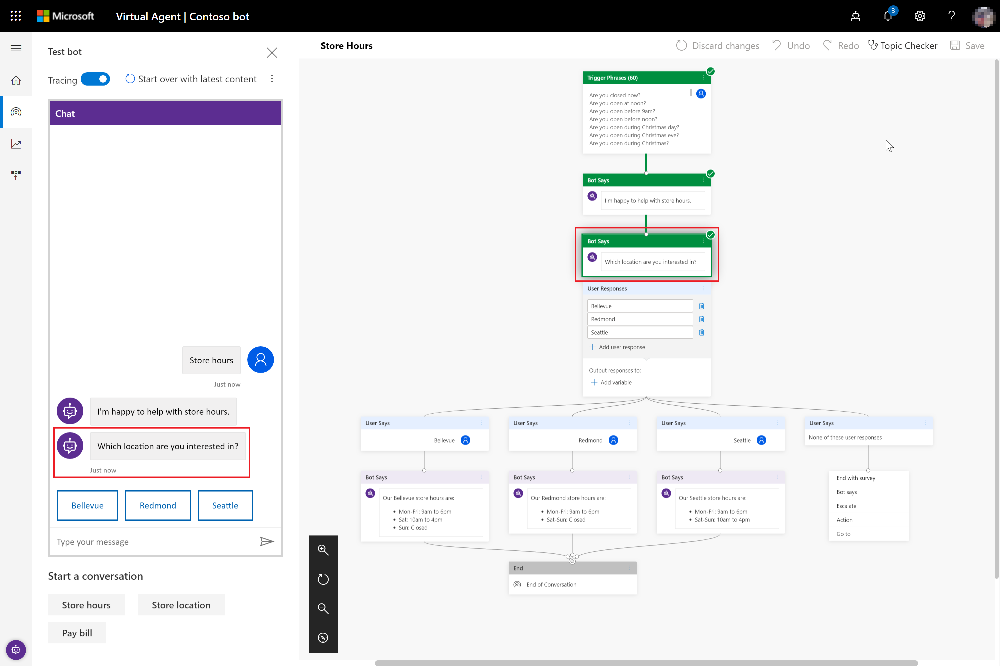

# Work with the Test bot pane

[!INCLUDE [cc-beta-prerelease-disclaimer](includes/cc-beta-prerelease-disclaimer.md)]

As you design your bot in Power Virtual Agents, you can use the **Test bot** pane to see how the bot leads a customer through the conversation path. To help you find and fix unexpected behavior, you can enable tracing to take you through the conversation path step by step, and go to the corresponding node in the conversation editor.

## To test a topic in the Test bot pane

1. To make sure you are using the most current bot content, select **Start over with latest content** at the top of the **Test bot** pane.

   

2. At the **Type your message** prompt at the bottom of the **Test bot** pane, enter a trigger phrase for the topic.

   

    The trigger phrase starts the topic's conversation, and the **Test bot** pane displays the bot responses and user response choices you specified.

   

3. Continue the conversation path until you complete the conversation.

   

   If the conversation editor is open, you can select a response in the **Test bot** pane, which will take you to the response in the conversation editor.

You can return to the conversation editor at any time to revise the topic's conversation path.

As you fine-tune your bot, it can be useful to enable tracing to take you through the conversation path step by step.

## To trace through the topic's conversation path

1. In the upper-left corner of the **Test bot** pane, select the **Tracing** toggle button to enable tracing.

   

2. Follow the steps discussed earlier to [test your topic in the Test bot pane](#to-test-a-topic-in-the-test-bot-pane).

3. As you move through the conversation in the **Test bot** pane, the conversation editor highlights the current place in the conversation path. The conversation editor displays highlighted nodes in green.

   

4. To navigate to an earlier place in the conversation path in the conversation editor, select it in the **Test bot** pane.

If the conversation path in the **Test bot** pane moves from one topic to another topic, the conversation editor refreshes and moves between topics to the appropriate highlighted nodes.
