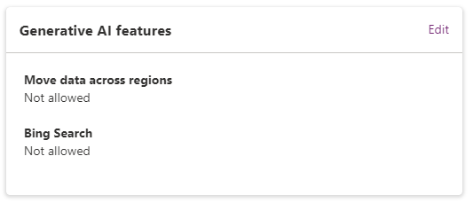
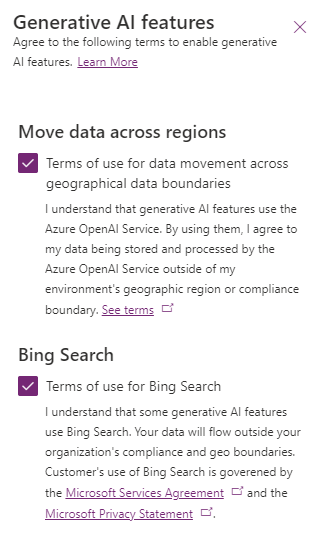
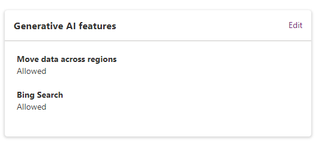

---
title: Move data across geographic locations for generative AI features outside United States
description: Enable data movement outside the United States for generative AI features, such as boost conversations, generative answers, and plugins.
keywords: "PVA"
ms.date: 11/14/2023
ms.service: power-virtual-agents
ms.topic: article
author: iaanw
ms.author: iawilt
manager: leeclontz
ms.reviewer: digantak
ms.custom: plugin
ms.collection: virtual-agent
---

# Configure data movement across geographic locations for generative AI features outside United States

[!INCLUDE[pva-rebrand](includes/pva-rebrand.md)]

With [the generative AI features in Microsoft Copilot Studio](nlu-gpt-overview.md), you can instantly build useful chatbots without creating complex conversation flows or manual authoring and configuration. 

These capabilities are available now in environments created for the United States and are rolling out to other [supported geographic locations](data-location.md?tabs=web#data-locations) starting in November, 2023.

Some non-United States geographic locations may require your global and Power Platform admins to enable these features in your environment. 

If these features haven't been enabled for your environment, bot authors will see an error banner in Copilot Studio on the copilots overview page:
  

You can continue to configure some Copilot Studio generative AI capabilities, but you'll also see the an error message when testing your copilot if the features are disabled.  
  

>[!IMPORTANT]
>  
>
> The underlying infrastructure for Copilot Studio is only available in the Power Platform environment regions located in the United States and some [geographic locations](data-location.md?tabs=web#data-locations).  
>  
> Accessing Copilot Studio generative AI features from regions outside the United States, **[results in data movement across regional boundaries**](#data-storage-and-processing-geographic-regions). 
> Once enabled, any data movement that occured while this feature was enabled **cannot be reversed by [removing your consent](#disable-data-across-geographic-locations-outside-the-united-states)**. 
>  
> Data from Copilot Studio generative AI features in the Europe, Switzerland, and France geographies are handled by the underlying infrastructure hosted in the Sweden or Switzerland regions. 
> Features powered by Bing are separately governed by the [Microsoft Services Agreement](https://go.microsoft.com/fwlink/?linkid=2178408) and [Microsoft Privacy Statement](https://go.microsoft.com/fwlink/?LinkId=521839).
>  
> Only global and Power Platform admins can enable and disable generative AI features for environments outside the United States.

## Enable data across geographic locations

You can allow Copilot Studio generative AI features in your Power Platform environments outside the United States geographic location:

1.  Open the [Power Platform admin center](https://admin.powerplatform.microsoft.com/).

2.  Select **Environments** in the navigation pane.

3.  Select your environment.

4.  On the side of the screen, select **Edit** on the **Generative AI features** card.  
    
    

5.  Read the information in the panel and select the checkbox to consent to the terms of use.  
    
    

6.  Select **Save**.

After your consent, the status on the **Generative AI features** card shows **Allowed** and Copilot Studio generative AI features are enabled in the environment. 

You can disallow Bing Search usage separately from data movement across regions; however, in order to use Bing Search, data movement across regions must also be allowed.

## Data storage and processing geographic regions

The following table provides information about the location of the Azure OpenAI and Bing Search geographic regions used by Power Platform, based on the Power Platform environment region where you have enabled data movement.

| **Power Platform environment geographic region**                         | **Data storage and processing region for Azure OpenAI** | **Data storage and processing region for Bing Search** |
|--------------------------------------------------------------------------|---------------------------------------------------------|--------------------------------------------------------|
| Australia, United Kingdom, United States                                 | Within the respective geographic region                 | United States                                          |
| Europe, France, Germany, Norway, Switzerland                             | Sweden or Switzerland                                   | United States                                          |
| Asia, Brazil, Canada, India, Japan, Singapore, South Africa, South Korea | United States                                           | United States                                          |

## Disable data across geographic locations outside the United States

Disable data movement across geographic locations by following these steps:

>[!WARNING] 
>  
> Any data movement that happened while this feature was enabled cannot be reversed by removing your consent.

1.  Open the [Power Platform admin center](https://admin.powerplatform.microsoft.com/).

2.  Select **Environments** in the navigation pane.

3.  Select your environment.

4.  On the side of the screen, select **Edit** on the **Generative AI features** card.

5.  Clear the checkbox for the terms of use.

6.  Select **Save**.

After you remove your consent, the status on the **Generative AI features** card shows **Not allowed**, disabling Copilot Studio generative AI features in the environment.

### See also
[Enable copilots and generative AI features in regions](/power-platform/admin/geographical-availability-copilot)
