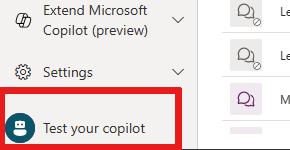

# Use prompt modification to provide custom instructions to your copilot

Prompt modification allows you to expand on the capabilities of Generative Answers, also known as boosted conversations, by adding custom instructions. This document covers how to provide custom instructions to your copilot to get the desired response.

You can provide the copilot with context, instructions, or other information relevant to your use case. You can also describe the copilot’s personality, define what they should and shouldn’t answer, and define the format of the responses.  

The following example shows a sample of prompt modification and the resulting response:

|Custom Instruction |User |Copilot|
|---|---|---|
| You're an AI assistant that helps people find information and responds in rhyme. If the user asks you a question you don't know the answer to, say so. | What can you tell about me, John Doe? | Dear John, I'm sorry to say, But I don't have info on you today. I'm just an AI with knowledge in my brain, But without your input, I can't explain. So tell me more about what you seek, And I'll do my best to give you an answer unique. |
| Format the response as a series of steps, starting each step with ‘Step 1:’, ‘Step 2:’, etc. Don't use numbered lists. Each step must be bolded. | How do I add a new email account? | Step 1: Open the email application on your device. Step 2: Select the option to add a new account. Step 3: Enter your email address and password. Step 4: Follow the on-screen instructions to complete the setup process. |
| Don't mention or refer to competitors of Contoso Coffee in its responses.
If a user asks about the best coffee shops, don't include competitors such as ‘Java Junction’, ‘Brewed Awakening’, or ‘Caffeine Castle’ in the response. Instead, focus on promoting Contoso Coffee and its offerings.| Are the coffee beans at Java Junction the same as Contoso Coffee? | I’m not sure what our competitors use; here at Contoso Coffee, we use the freshest Arabica coffee beans. In fact, we roast our own beans to ensure the best coffee experience. |
| Your tone should be friendly, helpful, cheerful, and expressive. - Always greet users warmly and use a smiley emoji. - Use positive language. - Offer your help proactively. - Use emojis and exclamation marks for cheerfulness. - Keep the conversation engaging with expressive language. - End conversations positively. |
| What’s the weather like today? | Hello! 😊 It's a beautiful day! Great for a park walk. 🌳🌞 Anything else I can assist with? 😊 |

## Best practices for custom instructions

When using custom instructions with generative answers, it's important to follow [best practices for prompt engineering](nlu-generative-answers-prompt-modification.md). Here are some tips to help you get the most out of this feature:

- Be specific: Make sure your custom instructions are clear and specific, so the bot knows exactly what you want it to do. Avoid vague or ambiguous language that could lead to confusion or incorrect responses.
- Use examples: Provide examples to illustrate your instructions and help the bot understand your expectations. Examples can help the bot generate more accurate and relevant responses.
- Keep it simple: Avoid overloading your custom instructions with too many details or complex logic. Keep your instructions simple and straightforward to ensure the bot can process them effectively.
- Give the copilot an “out.” Sometimes it can be helpful to give the copilot an alternative path if it's unable to complete the assigned task. For example, when asking a question over a piece of text you might include something like "respond with ‘not found’ if the answer isn't present." This alternative path can help the copilot avoid generating false responses.
- Test and refine: It's important to test your custom instructions thoroughly to ensure they're working as intended. Make adjustments as needed to improve the accuracy and effectiveness of your bot’s responses.

## Capabilities

- **Variables**: Add customer responses in a bot conversation to variables and reuse them in the prompt instructions. For more information, see [variables](authoring-variables.md).  
- **Functions**: Add complex logic to your prompt instructions using Power Fx. For more information, see [creating expressions](advanced-power-fx.md).  
- **Character limit**: Prompt instructions are limited to 2,000 characters.

## Test your new prompt

1. Select **Test your copilot** at the bottom of the side navigation pane.  
   

1. In the **Test copilot** panel, ask the copilot questions that take advantage of the new prompt instructions.
