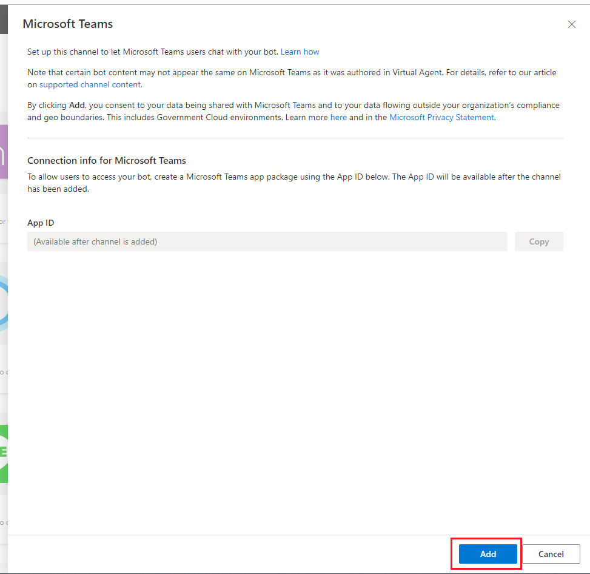
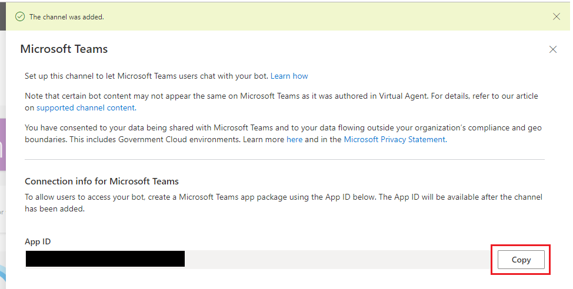
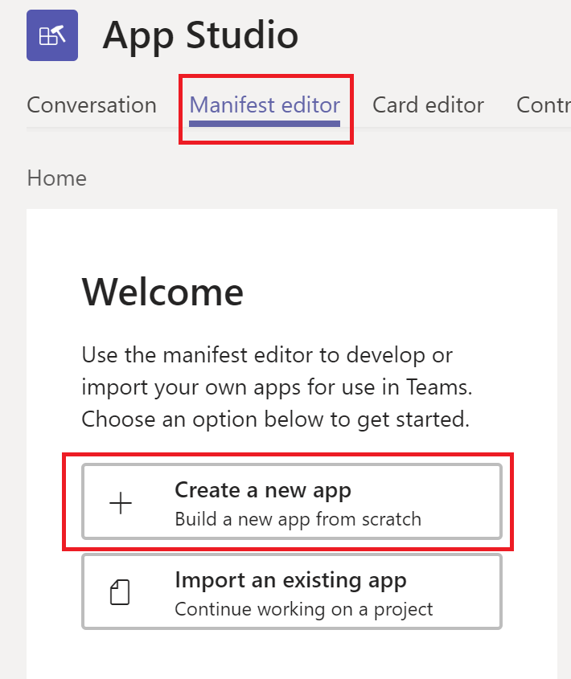
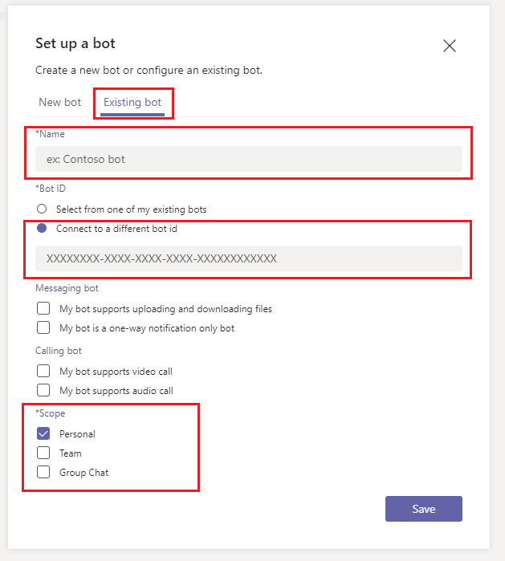
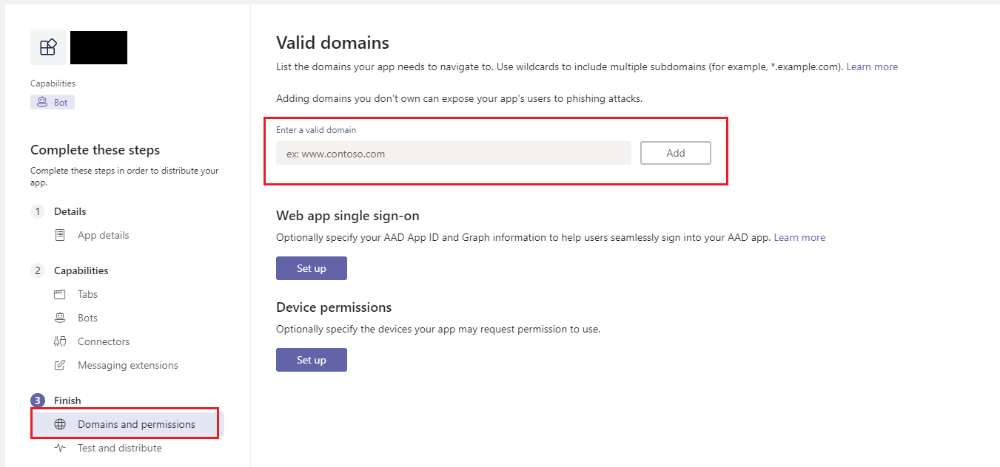
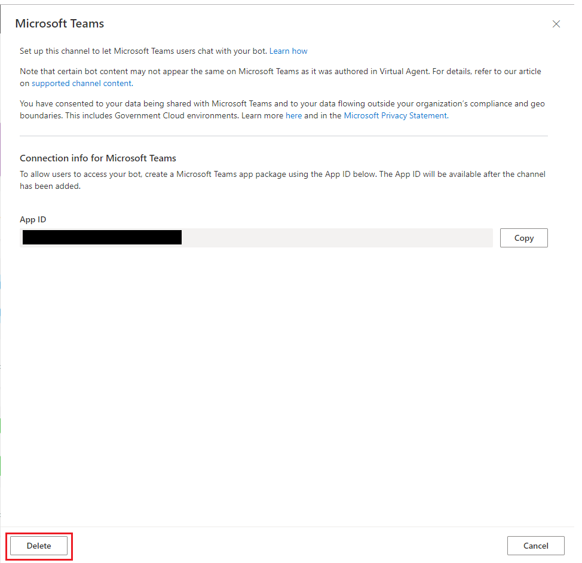

# Add bot to Microsoft Teams

[!INCLUDE [cc-beta-prerelease-disclaimer](includes/cc-beta-prerelease-disclaimer.md)]

You can add your bot to Microsoft Teams so other members of your organization can interact with it. You will need to [publish the bot at least once](publication-fundamentals-publish-channels.md#publish-the-latest-bot-content) before users can interact with the bot on Microsoft Teams.

You can also delete the bot from Microsoft Teams when you no longer want people to interact with it there, and you can distribute it as an app package within your Microsoft Teams tenant.

> [!NOTE]
> By adding the bot to Microsoft Teams, some of your data, such as bot content and end-user chat content, will be shared with Microsoft Teams (meaning that your data will flow outside of your [organization’s compliance and geographic or regional boundaries](data-location.md)).  
> For more information, see the [Microsoft Teams app privacy policy](/MicrosoftTeams/app-permissions).

## Add your bot to Microsoft Teams

Before adding your bot to Microsoft Teams, you should [publish your bot at least once](publication-fundamentals-publish-channels.md#publish-the-latest-bot-content). You will need to have [permission from your tenant admin to sideload a Teams app](/microsoftteams/teams-app-permission-policies) to complete the following instructions.

**Add bot to Microsoft Teams:**

1. Select **Manage** on the side navigation pane, and then go to the **Channels** tab.

2. Select **Microsoft Teams** and then select **Add**.

   

3. After Microsoft Teams is added successfully, copy the *App ID*. You will need this information for later.

   

4. [Install Microsoft Teams App Studio](/microsoftteams/platform/get-started/get-started-app-studio) and launch it in Microsoft Teams. Alternatively, you can also [directly create your application's manifest](/microsoftteams/platform/resources/schema/manifest-schema).

5. In App Studio, select **Manifest editor** and then select **Create a new app**.

   

6. Enter the necessary information about your bot and organization on the **App details** screen, and then select **Bots** on the side menu. 

7. Select **Set up**, select **Existing bot**, and then enter the bot's name.

8. Select **Connect to a different bot id** and paste the *App ID* you copied earlier. Under **Scope**, select **Personal** and then select **Save**.

   

9. This step is only needed if your bot requires an end user to sign in. Select **Domains and permissions** and add `token.botframework.com` under the **Valid domains** section.

   

10. Select **Test and distribute** to install the app directly to your Microsoft Teams instance, or download the app package to share with your teammates.

After installing the app package, you will automatically start a chat with the bot on Microsoft Teams.

## Remove your bot from Microsoft Teams

   > [!NOTE]
   > You cannot remove your bot from Microsoft Teams if you have set up Dynamics 365 Omnichannel for Customer Service with your bot.   
   > You must [remove the Omnichannel for Customer Service configuration](configuration-hand-off-omnichannel.md#remove-omnichannel-for-customer-service-connection) before you can remove the Microsoft Teams publication channel. 

**Remove bot from Microsoft Teams:**

1. Select **Manage** on the side navigation pane, and then go to the **Channels** tab.

2. Select **Microsoft Teams** and then select **Delete**.

   

## Updating bot content for existing conversations on Teams

To prevent disruptions during a chat between a user and the bot, existing conversations will not be updated to the latest bot content immediately after a new publish. Instead, the content will be updated after the conversation has been idle for 30 minutes..  

New conversations between user and the bot will have the latest published bot content.

## Distribute your Microsoft Teams bot

In addition to directly installing the Microsoft Teams app package, you can use Microsoft Teams to [distribute the app within your tenant](/microsoftteams/tenant-apps-catalog-teams) and [distribute the app publicly](/microsoftteams/platform/publishing/apps-publish). 

## Known limitations
- Currently only **Personal** scope is supported for Microsoft Teams.
- You will need to create a new bot if the Customer Satisfaction (CSAT) survey shows up as a card with missing icons for bots created during public preview to access the latest CSAT content.
- The icon and name of your bot on Microsoft Teams is not customizable by Microsoft Teams App Studio when sideloaded and published through the Microsoft Teams Tenant Apps Catalog. The Microsoft Teams App Studio bot icon and name customization will be applied to bots that are published through AppSource. Learn more at the Microsoft Teams [Publishing checklist](/microsoftteams/platform/publishing/office-store-checklist).
- Teams has [rate limiting](/microsoftteams/platform/concepts/bots/rate-limit) on bots. Depending on your business needs, you might want to keep your bot content concise for bots that are added to Microsoft Teams.
- Currently, if your bot supports [end-user authentication](advanced-end-user-authentication.md), the user will not be able to explicitly sign out. This will fail the Microsoft Teams AppSource certification if you are publishing your bot in the Seller Dashboard. This does not apply to personal or tenant usage of the bot. Learn more at [Publish your Microsoft Teams app](/microsoftteams/platform/publishing/apps-publish) and [AppSource Validation Policy](/office/dev/store/validation-policies).
- Removing the Microsoft Teams publication channel might take a few minutes before the bot becomes unreachable by users on Microsoft Teams.
