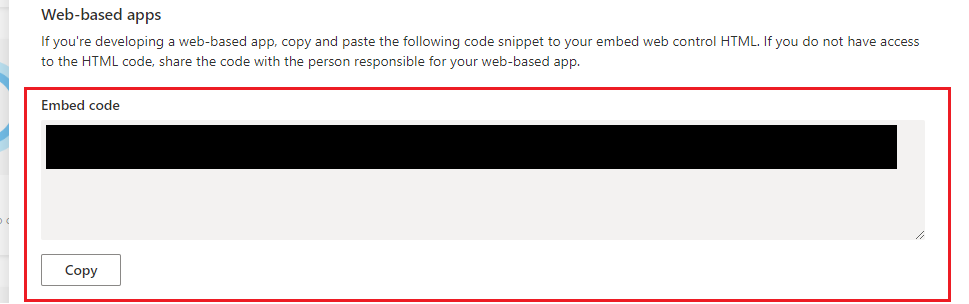
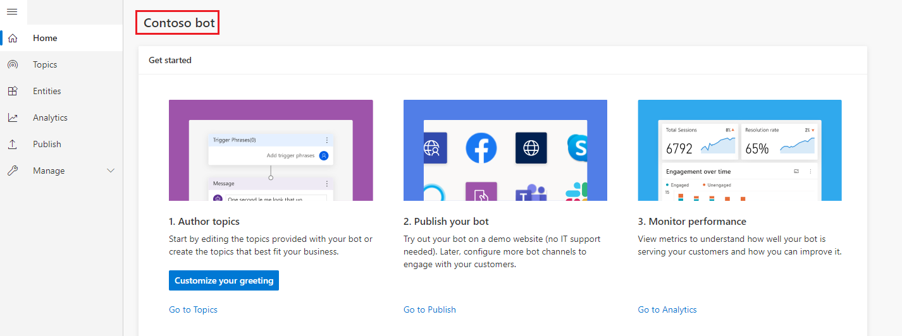
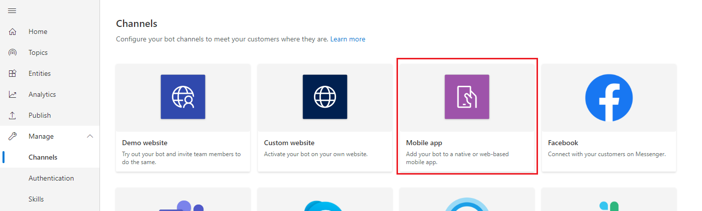
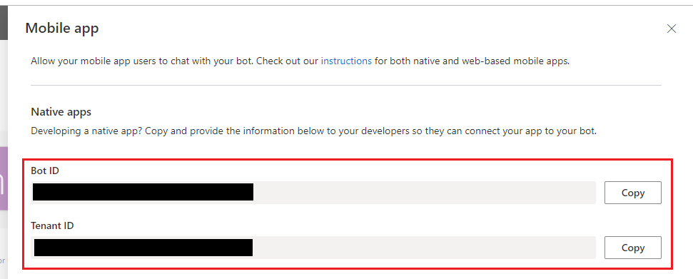

# Add bot to mobile and custom apps

[!INCLUDE [cc-beta-prerelease-disclaimer](includes/cc-beta-prerelease-disclaimer.md)]

You can connect your bot to a custom app so that the app's users can interact with the bot directly from within your app.

In most cases, your custom app will be a mobile-device app that is either a web-based app or a native app or adapter to other services that your business requires. 

There are different procedures for connecting to your mobile app, depending on whether your app is a web-based app or a native app.

Connecting your bot to a web-based app is relatively straightforward as it involves copying a code snippet into your app. However, both web-based apps and native or custom apps still require considerable developer expertise to fully integrate the bot into your app. Both procedures are described in this article.

## Prerequisites

- [!INCLUDE [Medical and emergency usage](includes/pva-usage-limitations.md)]


## Connect your bot to a web-based app


1. In Power Virtual Agents, select **Manage** on the side navigation pane, and then go to the **Channels** tab. 

1. Select the **Mobile app** tile to open the configuration window.

3. Copy the code under the **Web-based apps** section and provide it to your app developers to add to your web-based app.

    


## Connect your bot to a native or custom app

>[!TIP]
>While this section describes how to connect to a mobile app, the same process could be applied for custom or native apps, such as IoT (Internet of things) apps.

If your goal is to connect to Azure Bot Service channels, besides following the instructions here, your developers can learn more at [Connect your bot to Azure Bot Service channels](publication-connect-bot-to-azure-bot-service-channels.md).

>[!IMPORTANT]
>Instructions in this section require software development from you or your developers. It is intended for experienced IT professionals, such as IT admins or developers who have a solid understanding of developer tools, utilities, and IDEs.

### Prerequisites

- [.NET Core SDK](https://dotnet.microsoft.com/download) version 2.1
- Nuget package [Microsoft.Bot.Connector.DirectLine](https://www.nuget.org/packages/Microsoft.Bot.Connector.DirectLine)
- A bot created in Power Virtual Agents that you want to connect to your app

### Code samples
Code snippets used in this document are from:
- [Connector sample code](https://github.com/microsoft/PowerVirtualAgentsSamples/tree/master/BotConnectorApp)

### References
The instructions in this document reference the following:
- [Bot Framework Direct Line API](/azure/bot-service/rest-api/bot-framework-rest-direct-line-3-0-concepts?view=azure-bot-service-4.0&preserve-view=true)
- [Direct Line Authentication](/azure/bot-service/rest-api/bot-framework-rest-direct-line-3-0-authentication?view=azure-bot-service-4.0#secrets-and-tokens&preserve-view=true)
- [Contextual variables available upon hand-off](advanced-hand-off.md#contextual-variables-available-upon-hand-off)
- [Microsoft Bot Framework Activity](https://github.com/Microsoft/botframework-sdk/blob/master/specs/botframework-activity/botframework-activity.md)

### Retrieve your Power Virtual Agents bot parameters
To connect to the bot you have built with Power Virtual Agents, you will need to retrieve your bot's name, bot ID and tenant ID to identify it.

1. Copy your bot's name in Power Virtual Agents.

    

1. Select **Manage** on the side navigation pane, and then go to the **Channels** tab.

1. Select **Mobile app**.

    

1. Copy and save the *Bot ID* and *Tenant ID* value by clicking **Copy**. You will need these in the [Get Direct Line token](#get-direct-line-token) step.

    

### Get Direct Line token
To start a conversation with your Power Virtual Agents bot, you need a *Direct Line* token. You need to add code that retrieves a *Direct Line* token with the *Bot ID* and *Tenant ID* from the previous section to your app. 

To request a *Direct Line* token, issue a GET request to the endpoint below:

```
GET /api/botmanagement/v1/directline/directlinetoken
```

| Query Parameter | Required |
| --- | --- |
| `botId` | yes
| `tenantId` | yes |

Example:

```
GET https://powerva.microsoft.com/api/botmanagement/v1/directline/directlinetoken?botId=<ENTER-YOUR-BOTID>&tenantId=<ENTER-YOUR-TENANTID>
```
If the request is successful, a *Direct Line* token will be returned for the requested bot.

#### Sample code example

The following example uses samples from the [Connector sample code](https://github.com/microsoft/PowerVirtualAgentsSamples/tree/master/BotConnectorApp) to get a *Direct Line* token for a Power Virtual Agents bot.

  ```C#
  using (var httpRequest = new HttpRequestMessage())
  {   
      httpRequest.Method = HttpMethod.Get;
      UriBuilder uriBuilder = new UriBuilder(TokenEndPoint);
      uriBuilder.Query = $"botId={BotId}&tenantId={TenantId}";
      httpRequest.RequestUri = uriBuilder.Uri;
      using (var response = await s_httpClient.SendAsync(httpRequest))
      {
          var responseString = await response.Content.ReadAsStringAsync();
          string token = SafeJsonConvert.DeserializeObject<DirectLineToken>(responseString).Token;
      }
  }
  ```
  
  ```C#
  /// <summary>
  /// class for serialization/deserialization DirectLineToken
  /// </summary>
  public class DirectLineToken
  {
      public string Token { get; set; }
  }
  ```

The response will be:
  
  ```json
  {
    "token": "<token>"
  }
  ```


### Use Direct Line to communicate with the bot
After retrieving the *Direct Line* token, you are ready to have a conversation with your Power Virtual Agents bot with Direct Line. Follow the instructions at [Bot Framework Direct Line API](/azure/bot-service/rest-api/bot-framework-rest-direct-line-3-0-concepts?view=azure-bot-service-4.0&preserve-view=true) to start a conversation and send and receive messages.

#### Sample code example
The following example uses samples from the [Connector sample code](https://github.com/microsoft/PowerVirtualAgentsSamples/tree/master/BotConnectorApp) to start a conversation and send and receive messages from a Power Virtual Agents bot.

1. Initialize a DirectLineClient instance with the *Direct Line* token and start a conversation:


    ```C#
      // Use the retrieved token to create a DirectLineClient instance
      using (var directLineClient = new DirectLineClient(token))
      {
          var conversation = await directLineClient.Conversations.StartConversationAsync();
          string conversationtId = conversation.ConversationId;
      }
    ```

2. Once started, each conversation can be identified and connected using the combination of `token` and `conversationtId`. Send a user message to an existing conversation:

    ```C#
      // Use the retrieved token to create a DirectLineClient instance
      // Use the conversationId from above step
      // endConversationMessage is your predefined message indicating that user wants to quit the chat
      while (!string.Equals(inputMessage = /*Get_User_Input()*/, endConversationMessage, StringComparison.OrdinalIgnoreCase))
      {
          using (var directLineClient = new DirectLineClient(token))
          {
              // Send user message using directlineClient
              // Payload is a Microsoft.Bot.Connector.DirectLine.Activity
              await directLineClient.Conversations.PostActivityAsync(conversationtId, new Activity()
              {
                  Type = ActivityTypes.Message,
                  From = new ChannelAccount { Id = "userId", Name = "userName" },
                  Text = inputMessage,
                  TextFormat = "plain",
                  Locale = "en-Us",
              });
          }
      }
    ```

3. Retrieve the bot's response using the same `token` and `converstaionId`. The retrieved Direct Line response activities contains both the user's and bot's messages. You can filter response activities by your bot's name to get only the bot's response message.  

    ```C#
      // Use the same token to create a directLineClinet
      using (var directLineClient = new DirectLineClient(token))
      {
          // To get the first response set string watermark = null
          // More information about watermark is available at
          // https://docs.microsoft.com/azure/bot-service/rest-api/bot-framework-rest-direct-line-1-1-receive-messages?view=azure-bot-service-4.0
          
          // response from bot is of type Microsoft.Bot.Connector.DirectLine.ActivitySet
          ActivitySet response = await directLineClient.Conversations.GetActivitiesAsync(conversationtId, watermark);
          
          // update watermark from response
          watermark = response?.Watermark;
          
          // response contains set of Activity from both user and bot
          // To display bot response only, filter Activity.From.Name equals to your bot name
          List<Activity> botResponses = response?.Activities?.Where(x =>
                    x.Type == ActivityTypes.Message &&
                      string.Equals(x.From.Name, /*Bot_Name*/, StringComparison.Ordinal)).ToList();
          
          // Display botResponses
      }
    ```

### Refresh Direct Line token
You may need to add code to refresh the *Direct Line* token if your application has a lengthy conversation with the bot. The token expires but can be refreshed before it expires; learn more at [Direct Line Authentication](/azure/bot-service/rest-api/bot-framework-rest-direct-line-3-0-authentication?view=azure-bot-service-4.0#secrets-and-tokens&preserve-view=true).

#### Sample code example
The following example uses samples from the [Connector sample code](https://github.com/microsoft/PowerVirtualAgentsSamples/tree/master/BotConnectorApp) to refresh the token for an existing Power Virtual Agents conversation:

```C#
  // DirectLine provides a token refresh method
  // Requires the currentToken valid when refreshing
  string refreshToken = new DirectLineClient(currentToken).Tokens.RefreshToken().Token;
  // create a new directline client with refreshToken
  directLineClient = new DirectLineClient(refreshToken);
  // use new directLineClient to communicate to your bot
```


### Parse conversation payload from the bot
After starting a conversation with the bot, the conversation JSON payload uses the standard Microsoft Bot Framework Direct Line activity. You can learn more at [Bot Framework Direct Line API](/azure/bot-service/rest-api/bot-framework-rest-direct-line-3-0-concepts?view=azure-bot-service-4.0&preserve-view=true).

### Handle hand-off activity
If your application needs to hand off to a live agent provider, you will need to handle the hand-off activity. Hand-off activity is sent when the "Transfer to agent" node is hit. You can [learn more on the payload of the hand-off activity](configure-generic-handoff.md#sample-hand-off-message-payload).

### Trigger a welcome message
If you want your bot to send the Greeting system topic automatically when a user starts a conversation, you can send an activity with `Type=event` and `Name=startsConversation`.


