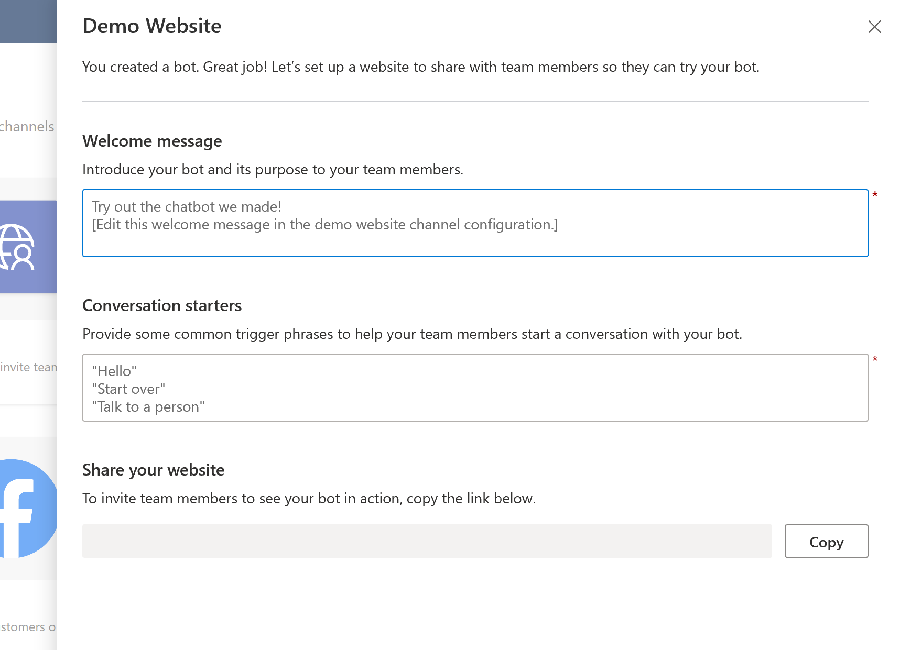
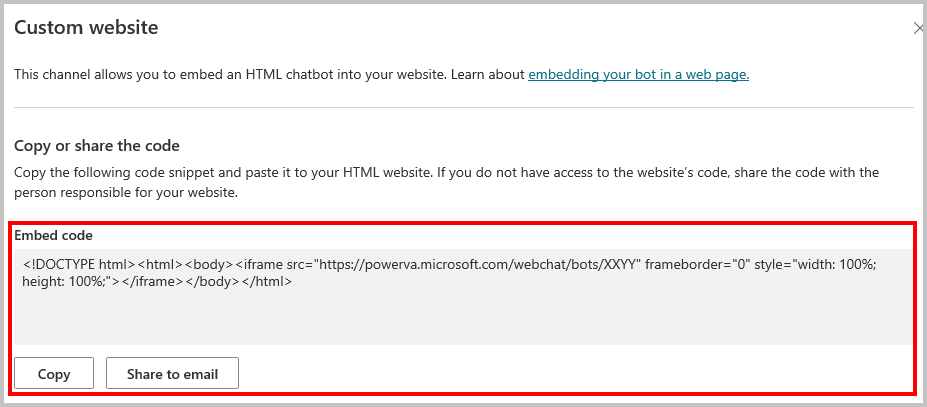

# Configure publication for the demo and your live website

When publishing the bot to the web, you can publish to a pre-built demo website, which you can use to share the bot with your teammates and stakeholders, and to your own live website.

>[!TIP]
>**When should I use the demo website and when should I use my own website?**
>You should use the demo website only to try out the bot and share it with your teammates or other stakeholders who want to try out the bot. It's not intended for production uses (for example, you shouldn't use it directly with customers).
>You should publish to and use the bot on your live website for production scenarios, such as a help bot on your help webpage for customers to interact with.

## Demo website
You can edit the welcome message and suggested trigger phrases for the demo website. This helps prompt your teammates for what they should ask the bot about. 

>[!TIP]
>You can change the welcome message to explain the intent or purpose for the testing, and you can change this as often as you like. So you could create a welcome message asking to test out conversations related to store hours and then change the welcome message to ask testers to try conversations related to gift cards.

**Update the demo website:**

1. Select **Manage** on the side navigation pane and then go to the **Channels** tab.
2. Select the **Demo website** tile.
3. Enter whatever welcome message you'd like to be displayed alongside the bot in the **Welcome message** text field.
4. Enter a list of suggested trigger phrases in the **Conversation starters** text field. Trigger phrases are what initiate specific topics, so you could customize these to specific topics that you want your teammates to try out.

To share the demo website link, simply copy the demo website URL and share it with your teammates directly. 

### Custom website

You can add your bot to a live website as an iFrame. You can get to the iFrame snippet by selecting **Manage** on the side navigation pane and then going to the **Channels** tab. Select the **Custom website** tile.

You can then copy the iFrame snippet directly or share it via email. This is useful so you can share it with your website admin or developer who can insert it into your website for you.

