# Quickstart: Create and deploy a customer service bot

[!INCLUDE [cc-beta-prerelease-disclaimer](includes/cc-beta-prerelease-disclaimer.md)]

Power Virtual Agents empowers customer teams to quickly and easily create powerful bots using a guided no-code graphical experience—all without the need for data scientists or developers. 

This quickstart guide takes you through the end-to-end experience of creating a bot for the first time, adding custom topics to your bot, testing content changes in real time, deploying your bot to a test page, and analyzing the performance of your bot after it’s been deployed. 

<iframe width="560" height="315" src="https://www.youtube.com/embed/eM-hs7maZko" frameborder="0" allow="accelerometer; autoplay; encrypted-media; gyroscope; picture-in-picture" allowfullscreen></iframe>

## Create your first bot

1.	Go to [https://aka.ms/virtual-agent](https://aka.ms/virtual-agent) in your browser to begin. Supported browsers include Microsoft Edge, Chrome, and Firefox. On the website, select **Try preview**, and then sign in with your work email address. Note that personal Microsoft accounts aren't supported currently.

    

2. Next, you’ll choose a name for your bot. This can be something generic to your company or specific to the scenario you are tailoring your bot to.
Your bot is created in the default PowerApps environment that was created for you when you signed up. For most users, this is sufficient. However, if you want to specify a custom PowerApps environment for your Power Virtual Agents, you can do so by expanding the **More options** menu and selecting a different environment.
   > [!NOTE] 
   > Preview is currently supported only in the locations listed in the [supported data locations](data-location.md) topic, with data stored in respective data centers. If your company is located outside of the supported data locations, you need to create a custom environment with **Region** set to a supported data location before you can create your bot. For more information on how to create a custom PowerApps environment, see [Creating a PowerApps environment](getting-started-new-environment.md).

   

3.	Once you select **Create**, the process of creating the first bot within a new environment can take up to 15 minutes. Subsequent bots will be created much faster. 

4. After a few minutes, you’ll land on the home page and have an opportunity to play around with the bot in read-only mode. You can't save any edits during this time, but you can explore the overall user interface, look at the topics, experiment with the preloaded User Topics and System Topics, and interact with your bot using the Test Canvas. During this time, you can also [watch product videos](videos.md) to learn how to complete tasks such as creating a branching dialog tree using variables and expressions, or [creating a Flow and embedding Flows](how-to-flow.md) within your dialog tree.
    
   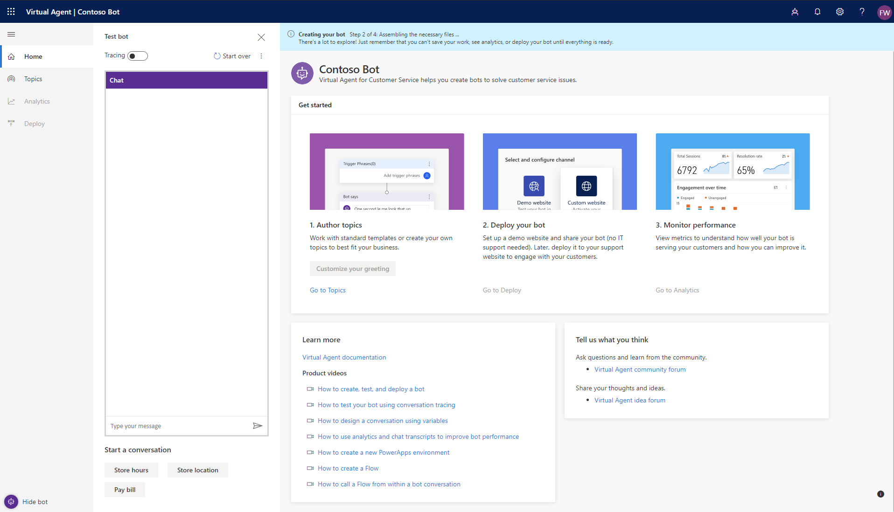

5. When the bot creation process completes, the banner changes. You now have full functionality in the bot and can modify any User or System topic, test out your content changes, or deploy your bot.

   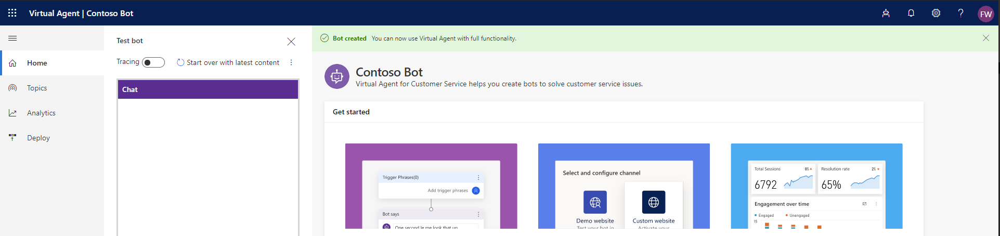

## Create a custom topic

1.	Now that you have full functionality within your bot, you can create your own custom topic—or, in other words, a dialogue tree specifying how your bot responds to a user’s question 

2.	Start by selecting **Topics** in the left pane, and then select **New topic** at the top of the page.

    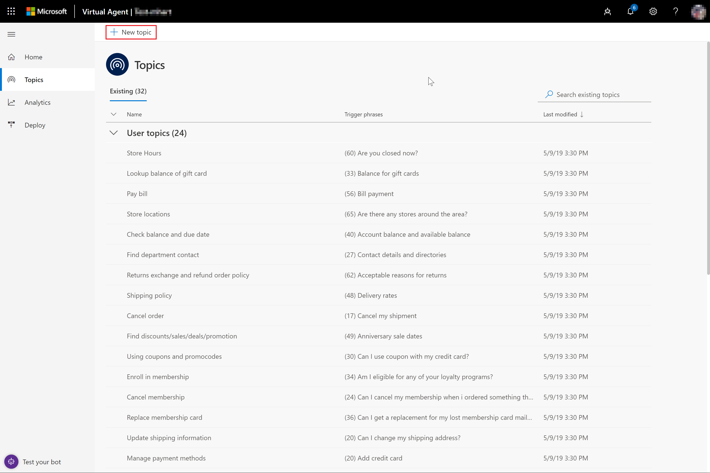

3. You can now name your topic and include some trigger phrases for this topic. Trigger phrases are examples of the type of user questions or utterances that help teach the bot when to respond with this dialogue. As an example, let’s create a topic called “Personal Hello World” and add “hello world” as a trigger phrase. Select **Save topic**, and then select **Edit** to proceed.
    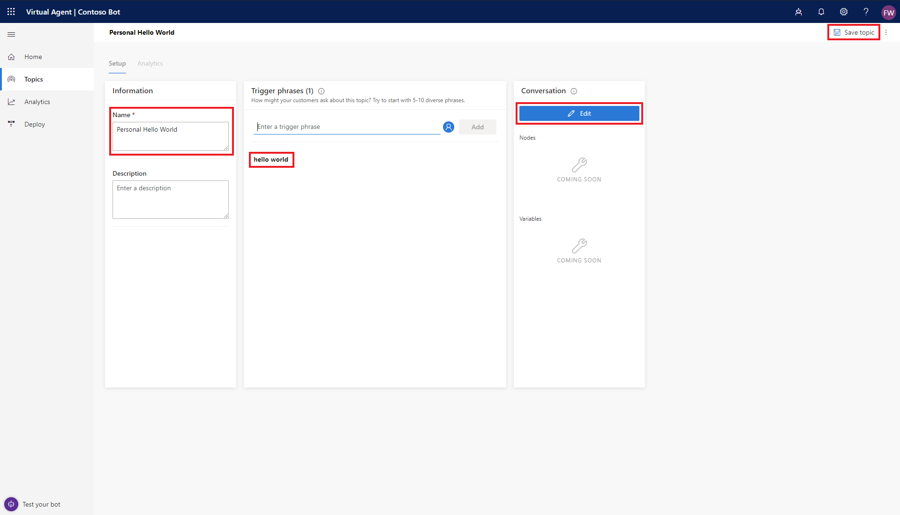

4. After saving your topic, you land in the conversation editor. This is the graphical dialogue tree editor that allows you to define bot responses and overall conversation flow.

   Start by entering “Hello! I’ll create a personalized greeting for you.” into the first Bot Says node. Then, add another Bot Says node by selecting it in the menu below the first Bot Says node.    
    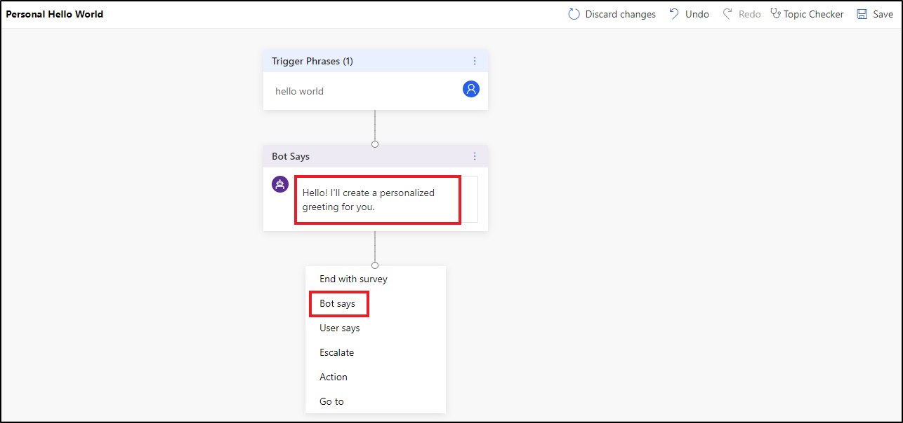

5. In the second Bot Says node, enter “Where do you live?”, and select **User Says** from the menu below the second Bot Says node. Select **Add user response**.
    

6. For the two “User Says” responses, enter “Seattle” and “Bellevue” in the User Responses node. Now, enter “Hello Seattle!” in the Seattle branch on the left and “Hello Bellevue!” in the Bellevue branch on the right. Select **Save** in the upper-right corner.
    

You now have a very simple branching dialogue tree—congratulations! You can begin to create more complex versions of this tree by incorporating variables, expressions, and Power Automate.

> [!NOTE]
>  
> Have a look at these related videos: 
>
> [Using variables and expressions to create dynamic dialogues](https://go.microsoft.com/fwlink/?linkid=2063539)  
> 
> [Creating and using Flows for extensible dialogues](https://go.microsoft.com/fwlink/?linkid=2079323).
 
## Test your content in real time

1.	Now that you have some content authored into a dialogue tree, it’s time to test this out in real time to see if it’s working as you expected. For this, you’ll use the Test bot panel. Begin by selecting **Start over with latest content** near the top of this panel.

    
 
    If the test bot is not showing on your screen, select **Test your bot** in the lower-left corner of your screen.

    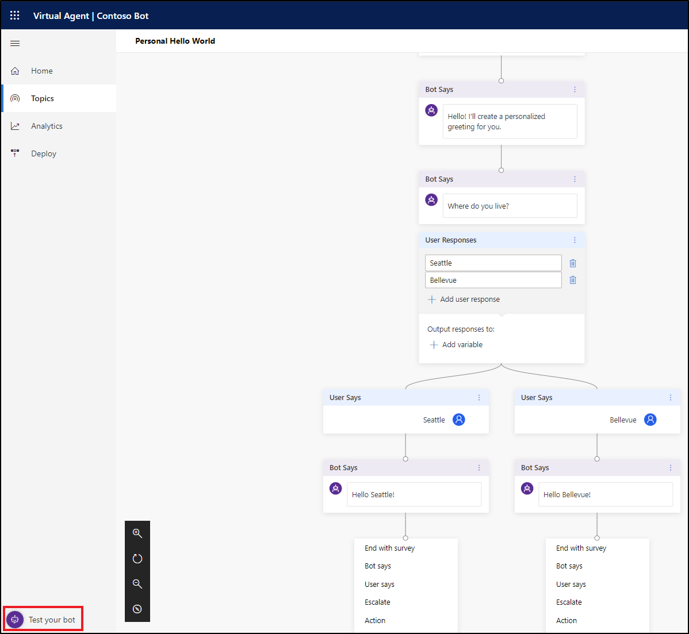

2.	Now that the latest content has been refreshed in the test bot, you can try out your newly authored dialogue tree by typing into the test bot window. Turn on **Tracing** at the top, which enables you to follow along with the bot as it executes your dialogue. You’ll start to see parts of your dialogue tree highlighted as the bot gets to that portion of the dialogue.

    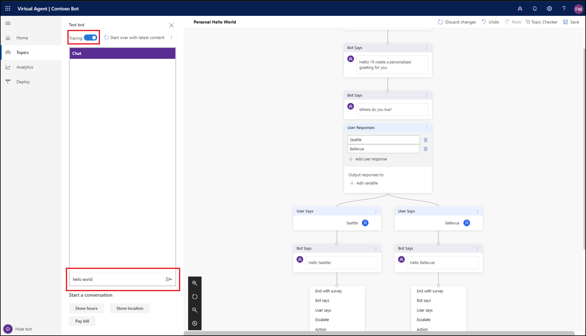

3.	Type "hello world" in the chat window, and send the message to the bot. You’ll see the top portion of your dialogue tree highlighted in green, and you’ll see “Seattle” and “Bellevue” presented as user options in the test bot window.
The bot is now waiting for you to respond and has provided suggestions on how to respond. These suggestion buttons reflect what you authored within your dialogue tree in the User Responses node. In the test bot, you can either select these suggestion buttons to continue, or you can enter your response into the chat window. 

    
	 

4.	You can continue the dialogue by selecting the Seattle branch. You’ll see the dialogue stop once you’ve reached the bottom of this branch. If you author more content, the dialogue will continue, but since we’ve only created a very simple and small dialogue tree, we can reach the end of the content very quickly.

    This test experience empowers you to quickly create and test a conversation to ensure that the conversation will flow as anticipated. If the dialog does not reflect your intention, you can change the dialog, save it, push the latest content into the test bot, and try it out again. None of this changes the deployed version of the bot, so feel free to play around with your content until you are happy with it.
 
    

## Deploy your bot

1.	Once you are fine with the content authored in your bot, you can deploy your bot to a website. Start by selecting the **Deploy** tab in the left pane.

    You’ll now see two options—one to deploy to a demo website, and one to deploy to a custom website. The custom website provides a snippet of code to send to your website administrator. This embeds the bot canvas into the website of your choosing so that your end users can interact with your bot from your web channel.

    At this point, it’s premature to deploy your bot to your website, so let’s start with the demo website instead. Select **Demo website**.

    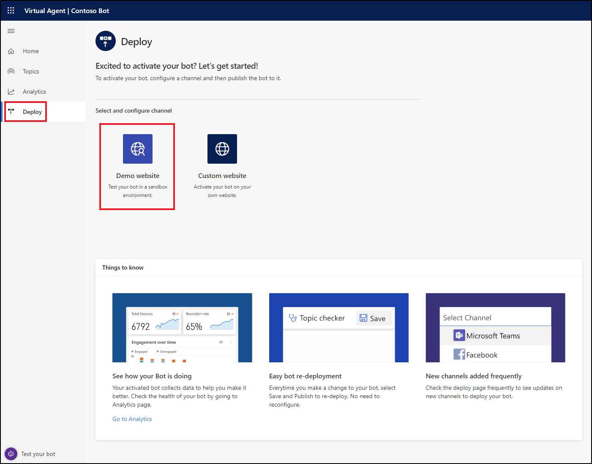
 
2.	Enter a welcome message and the conversation starters that will be displayed on your demo website.
For now, enter “This is a demonstration of my first bot that I built by myself, without writing a line of code!” in the welcome message and “Hello world” in the conversation starters. Select **Publish**.

    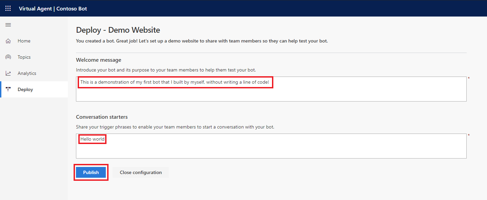
 
3.	A new window opens in your browser. If this doesn’t happen automatically, check whether a pop-up blocker has been activated and, if so, allow the window to be opened. Usually, you can allow pop-ups from the URL field directly. This is a webpage that demonstrates what your bot looks like to an end-user who comes to your webpage. The bot canvas is in the lower-right corner, and you can interact with it by either typing into the window or by selecting the “Hello world” conversation starter you added previously.

    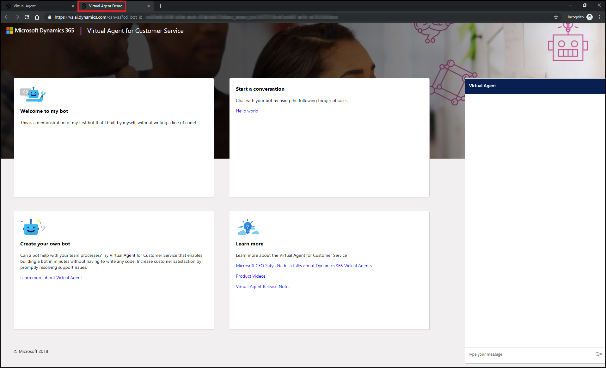

4.	You'll find a link added to the Deploy page. This link can be copied and shared with others in your organization and is a great way for others to experience the bot that you have created. This URL is also the same as the one shown in the test webpage.

    > [!NOTE]
    > Anyone with this link can interact with your bot using the test webpage, so please do not share sensitive information in this bot. Your visitors will interact with your bot as an “end-user” but will not be able to see the conversation editor.

    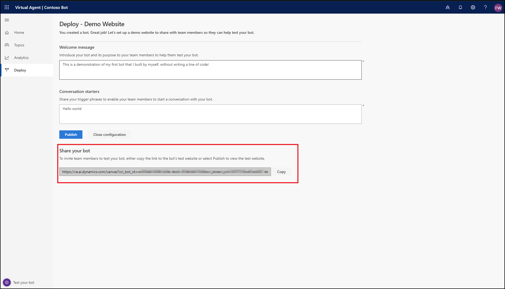

## Analyze the performance of your bot

1.	Once your bot has completed interactions with users, the statistics are available via the **Analytics** tab in the left pane. Here, you can find key performance indicators (KPIs) showing the volume of sessions your bot has handled, how effectively your bot was able to engage end-users and resolve issues, escalation rates to human agents, and abandonment rates during conversations. You will also find customer satisfaction information at the KPI level as well as in the **Customer Satisfaction** tab.

    > [!NOTE]
    > There is up to a 1-hour delay between when the conversations occur and when the statistics for those conversations appear in the analytics views. Also, all interactions with the bot are logged in analytics, including interactions from your demo website, custom website, or test bot.

    

2.	You can also view detailed session history and transcripts by selecting **Sessions** from the **Analytics** tab. This enables you to download a CSV file with the full session transcript. This can be a helpful way for you to tune the performance of your bot and change the content in your topics to improve your bot’s efficiency.

    

    For more information, see [Using analytics to improve your bot](getting-started-analytics.md).

You’ve now created a bot, created your own custom topic, tested it out, deployed it to a demo website, and learned how to analyze your bot’s performance. Congratulations! Your bot has many capabilities beyond this, so please try it out and play with the advanced features

For questions not covered in the product documentation or for feature ideas, please [visit our community](https://go.microsoft.com/fwlink/?linkid=2058639) and post questions or ideas.

For more guidance on how to connect to your existing case logs and automatically discover new topics, please try out [Dynamics 365 Customer Service Insights](https://dynamics.microsoft.com/ai/customer-service-insights/).
