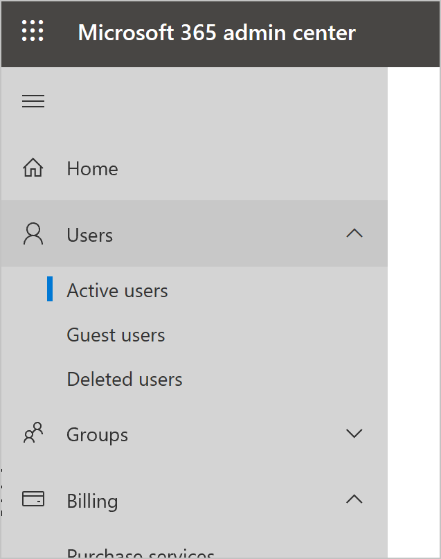
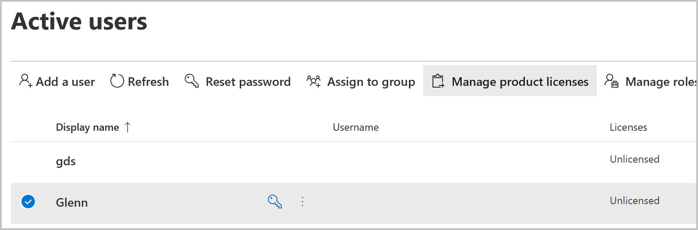

# Assign licenses and manage access to Power Virtual Agents

Select the version of Power Virtual Agents you're using here:

> [!div class="op_single_selector"]
> - [Power Virtual Agents web app](requirements-licensing.md)
> - [Power Virtual Agents app in Microsoft Teams](teams/requirements-licensing-teams.md)

This documentation is written for tenant admins. If you want to sign up for Power Virtual Agents as an individual, see the [Sign up for a Power Virtual Agents trial](sign-up-individual.md) topic.

To create and manage bots with Power Virtual Agents, you need:

- A license for each user, also known as a "per user license" (or "Power Virtual Agent User License" as referred to on the [Microsoft 365 admin center](https://admin.microsoft.com)), should be assigned to individual users who need access to create and manage chatbots.
- A license for your organization, also known as a "tenant license" (or "Power Virtual Agent" as referred to on the [Microsoft 365 admin center](https://admin.microsoft.com)), should be acquired by the tenant admin. This license cannot be assigned to individual users.

>[!NOTE]
>Users of your bot don't need a special license. After you publish your bot, anyone who can access where you published the bot can interact with the bot.

More information: [Licensing guide](https://go.microsoft.com/fwlink/?linkid=2085130)

> [!NOTE]
> To follow the instructions in this topic, you must use the non-preview version of the admin center (ensure the **Try the new admin center** setting is turned off).
  
>[!IMPORTANT]
>If you purchase a Power Virtual Agents license through volume licensing or any channel other than the [Microsoft 365 admin center](https://admin.microsoft.com/admin/default.aspx), you need to acquire both a tenant license and a user licenses through that channel, preferably as part of a single transaction.
  
## Prerequisites

- [!INCLUDE [Medical and emergency usage](includes/pva-usage-limitations.md)]

## Buy a tenant license

Purchase licenses for your organization by going to the [Microsoft 365 admin center](https://admin.microsoft.com/admin/default.aspx). You'll need to sign in with an admin account to buy licenses.

1. Go to the [Microsoft 365 admin center](https://admin.microsoft.com/admin/default.aspx) and sign in with your admin account.

2. On the navigation pane, expand the **Billing** menu, and then select **Purchase services**.

3. Search for **Power Virtual Agent**, and complete the checkout process.

## Acquire user licenses

1. After you've purchased a Power Virtual Agents license from the Microsoft 365 Admin Center, you need to purchase user licenses to give users access to the product. In the Microsoft 365 admin center, go to **Billing**, and then select **Purchase services**.

2. Scroll down to the **Add-ons** section.

3. Look for **Power Virtual Agent User License**. Select the number of licenses you need, and complete the checkout process.

>[!IMPORTANT]
>If you purchased a Power Virtual Agents license through volume licensing or any channel other than the [Microsoft 365 admin center](https://admin.microsoft.com/admin/default.aspx), you need to acquire both a tenant licence and user licenses through that channel, preferably as part of a single transaction.

## Assign licenses to users

1. Go to the [Microsoft 365 admin center](https://admin.microsoft.com/admin/default.aspx) and sign in with your admin account.

2. On the navigation pane, expand the **Users** menu, and then select **Active users**.

    

3. Select a name, and then select **Manage product licenses**.

   

4. On the flyout panel, select the check box next to **Power Virtual Agent user license**, and then select **Save changes**. 

Repeat these steps to add more users, or exit the Microsoft 365 admin center if you're finished.

  > [!NOTE]
  > To simplify user license management, you can assign licenses to an Azure Active Directory (Azure AD) security group. More information: [Assign licenses to users by group membership in Azure Active Directory](/azure/active-directory/users-groups-roles/licensing-groups-assign)

The users can now sign in to the [Power Virtual Agents portal](https://powerva.microsoft.com).

## How to differentiate between tenant and user licenses

If you are unsure whether you have both of the required licenses, on the [Microsoft 365 admin center](https://admin.microsoft.com) go to **Billing** and then **Subscriptions** to see the list of active licenses. For Power Virtual Agents you should see two licenses:
1. Power Virtual Agent.
2. Power Virtual Agent User License.

You can only assign the "Power Virtual Agent User License" to specific users. You don't need to assign the "Power Virtual Agent" license.

## Trial plans

Users in your organization can try Power Virtual Agents for a limited time period.

You can [disable or enable the ability for users to sign up for a trial themselves](/azure/active-directory/users-groups-roles/directory-self-service-signup) by modifying the **AllowAdHocSubscriptions** flag in your organization settings. 

## Subscription capacity

When you purchase a license, you gain capacity for the specified number of billed sessions. Power Virtual Agents pools this capacity across the entire tenant. 

The consumption of the capacity isn't reported at the tenant level, but [can be seen for each individual bot](analytics-billed-sessions.md).

See [Quotas and rate limit capacity considerations for Power Virtual Agents](requirements-quotas.md) for more information.

## Using Power Automate with a Power Virtual Agents license

[See Power Automate request limits for Power Virtual Agents](requirements-quotas.md#power-automate-request-limits)
[See how to use Power Automate with Power Virtual Agents](advanced-flow.md). 

