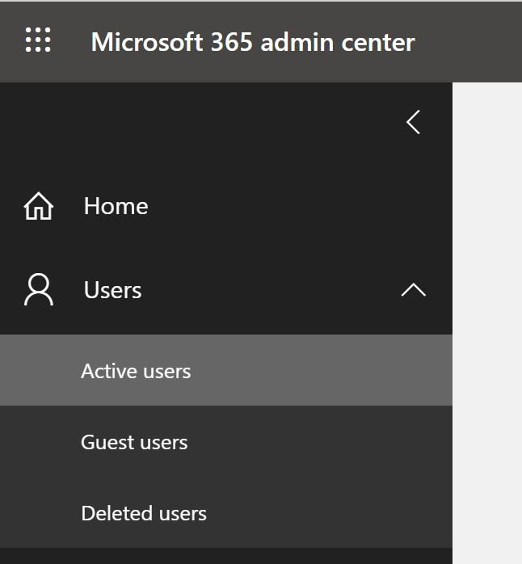
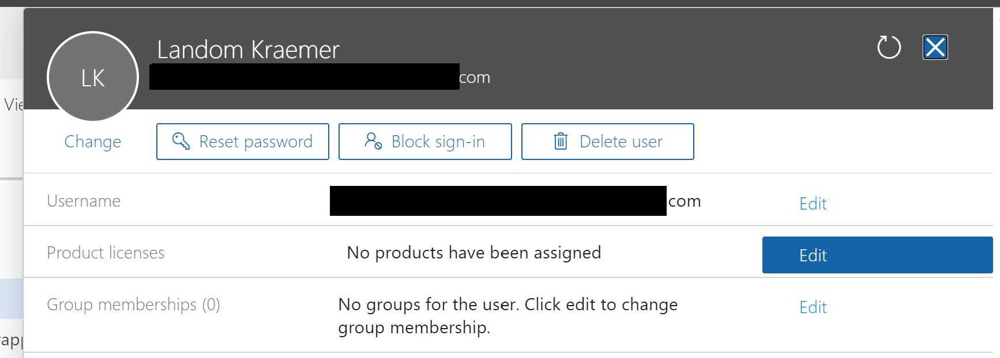

# Assign licenses and manage access to Power Virtual Agents

To create and manage bots with Power Virtual Agents, you need a license for each user (a "per user license"), as well as a license for your organization (a "tenant license"). 

>[!NOTE]
>End users of your bot don't need a special license. After you publish your bot, anyone who can access where you published the bot can interact with the bot.

For more information about Power Virtual Agents licensing, see the [licensing guide](https://go.microsoft.com/fwlink/?linkid=2085130). 

> [!Note]
> To acquire a Power Virtual Agents user license you need to use the non-preview version of the Admin portal. Ensure the **Try the new admin center** setting is turned off.
  
## Buy tenant license
You can purchase Power Virtual Agents licenses for your organization on the [Microsoft 365 admin center](https://admin.microsoft.com/admin/default.aspx) (you will need to sign in with an admin account).

1. Go to the [Microsoft 365 admin center](https://admin.microsoft.com/admin/default.aspx) and sign in with your admin account.

2. On the navigation pane, expand the **Billing** menu and then select **Purchase services**.

3. Search for **Power Virtual Agents license** and complete the checkout process.

## Acquire user licenses

1. After you have purchased a Power Virtual Agent license, you need to acquire user licenses to give users access to the product. In the Microsoft 365 admin center, go to **Billing** and select **Purchase services**.

2. Scroll down to the **Add-ons** section.

3. Look for **Power Virtual Agent User License**. Select the number of licenses you need and finish the checkout process.

## Assign licenses to users

1. Go to the [Microsoft 365 admin center](https://admin.microsoft.com/admin/default.aspx) and sign in with your admin account.

2. On the navigation pane, expand the **Users** menu and then select **Active users**.

    

3. Select the name, and then select **Manage product licenses**.

   

4. On the flyout panel, select the checkbox next to **Power Virtual Agents user license**. Select **Save changes**. 

5. Repeat these steps to add more users, or exit the Microsoft 365 admin center if you're finished.

  > [!NOTE]
  > To simplify user license management you can assign licenses to an Azure Active Directory (AAD) security group. For more information see [Assign licenses to users by group membership in Azure Active Directory](/azure/active-directory/users-groups-roles/licensing-groups-assign).

The users can now sign in to the [Power Virtual Agents portal](https://powerva.microsoft.com).

## Trial plans
Users in your organization can try Power Virtual Agents for a limited time period.

You can disable or enable the ability for users to sign up for a trial themselves by modifying the **AllowAdHocSubscriptions** flag in your organization settings. For mMore information see [What is self-service sign-up for Azure Active Directory?](/azure/active-directory/users-groups-roles/directory-self-service-signup). 

## Subscription capacity
When you purchase a license you gain capacity for the specified number of billed sessions. The capacity is pooled across the entire tenant and any user who has access to Power Virtual Agents can build bots that use this capacity. 

The capacity is currently not reported at the tenant level, but is available for each individual bot. [Learn more](analytics-billed-sessions.md) about billed sessions.

## Using Power Automate with a Power Virtual Agents license
[See how to use Power Automate with Power Virtual Agents](advanced-flow.md). 

