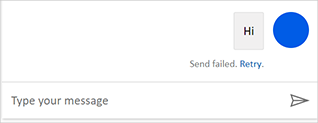

# Quotas and request limit capacity considerations for Power Virtual Agents

Quotas are default constraints applied to chatbots that limit how often messages can be sent to the chatbot. The purpose of quotas is to throttle the service load for a client, which protects a service from being overloaded and the client from unexpected resource usage.

Quotas are applied to your chatbots alongside the capacity constraints you gained by purchasing a [Power Virtual Agents plan](https://powervirtualagents.microsoft.com/pricing). Also see [Licensing and capacity considerations](requirements-licensing.md).

The following quotas, defined as requests per minute (RPM) and requests per second (RPS), apply to Power Virtual Agents chatbots. A request is a message from the user to the chatbot, or a message from an Azure Bot Framework Skill, in a single chat session.  
  
  

Action | Quota with the paid plan
--|--
**Messages to a chatbot** Includes any message from a user or from integrations, such as Azure Bot Framework Skills, to a single chatbot. This includes multiple users interacting with a single chatbot. | 800 RPM\* 	

\*Chatbots created in the North America region support 600 RPM. 800 RPM applies to [all other supported regions](data-location.md).

## Error messages when quotas are met

If the quota for **messages to a chatbot** is met, the user chatting with the chatbot will see a failure notice when they try to send a message. They'll be prompted to retry.

 

## Power Automate Request limits
As described in the [licensing guide](https://go.microsoft.com/fwlink/?linkid=2085130), Power Automate usage rights are included with a Power Virtual Agents subscription. 

Flows created from the [Power Virtual Agents authoring canvas](advanced-flow.md#create-a-new-flow-from-the-power-virtual-agents-authoring-canvas) have the following limits:

License | Number of API requests every 24 hours
--|--
**Power Virtual Agents** | 15,000 per flow 	

Learn more about [Power Automate limits](/power-platform/admin/api-request-limits-allocations)

> [!NOTE]
> For flows created from the Power Virtual Agents authoring canvas you will see the plan used as "Per user plan". Regardless of what your per-user license is, the above limit will apply.

