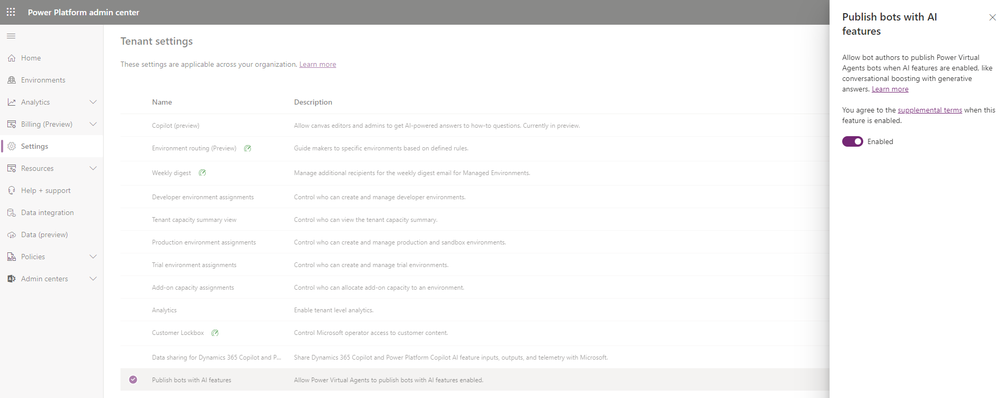

---
title: Security and governance in Copilot Studio  
description: Use the security and governance controls in Power Platform and Microsoft 365 to manage the security of your data when creating, publishing, and using copilots built with Copilot Studio.
keywords: "PVA"
ms.date: 11/14/2023
ms.service: power-virtual-agents
ms.topic: article
author: iaanw
ms.author: iawilt
manager: leeclontz
ms.reviewer: digantak
ms.custom: plugin
ms.collection: virtual-agent
---

# Copilot Studio security and governance

[!INCLUDE[pva-rebrand](includes/pva-rebrand.md)]

Microsoft Copilot Studio follows the Security Development Lifecycle (SDL). The SDL is a set of strict practices that support security assurance and compliance requirements. Learn more at [Microsoft Security Development Lifecycle Practices](https://www.microsoft.com/securityengineering/sdl/practices).

The Copilot Studio service is governed by your commercial license agreements, including the [Microsoft Product Terms](https://go.microsoft.com/fwlink/?linkid=2182773) and the [Data Protection Addendum](https://go.microsoft.com/fwlink/?linkid=2153219). For the location of data processing, refer to the [geographical availability documentation](https://dynamics.microsoft.com/availability-reports/).

The [Microsoft Trust Center](https://www.microsoft.com/trustcenter) is the primary resource for Power Platform compliance information. Learn more at [Copilot Studio Compliance Offerings](admin-certification.md).

Furthermore, Power Platform has an extensive set of [Data Loss Prevention features](/power-platform/admin/prevent-data-loss) to help you manage the security of your data. Learn how to [Configure Data Loss Prevention policies for bots](admin-data-loss-prevention.md) in your organization.

To further govern and secure Copilot Studio using generative AI features in your organization, you can do the following,

1.  Disable bot publishing:

    -   Your admin can disable the ability to publish bots with generative answers and actions for your tenant in the **Power Platform admin center**.  

        

    -   Your admin can disable Copilot for your organization by creating a support request.

2.  [Disable data movement across geographic locations for Copilot Studio generative AI features outside the United States](manage-data-movement-outside-us.md#disable-data-across-geographic-locations-outside-the-united-state)). 

3.  [Enable Copilot Studio conversational plugins](copilot-conversational-plugins.md).

Finally, Copilot Studio supports [securely accessing customer data using Customer Lockbox](/power-platform/admin/about-lockbox)