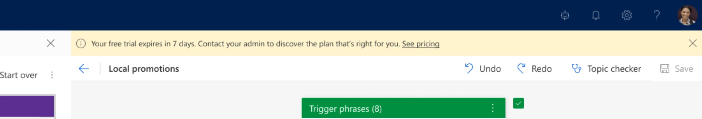
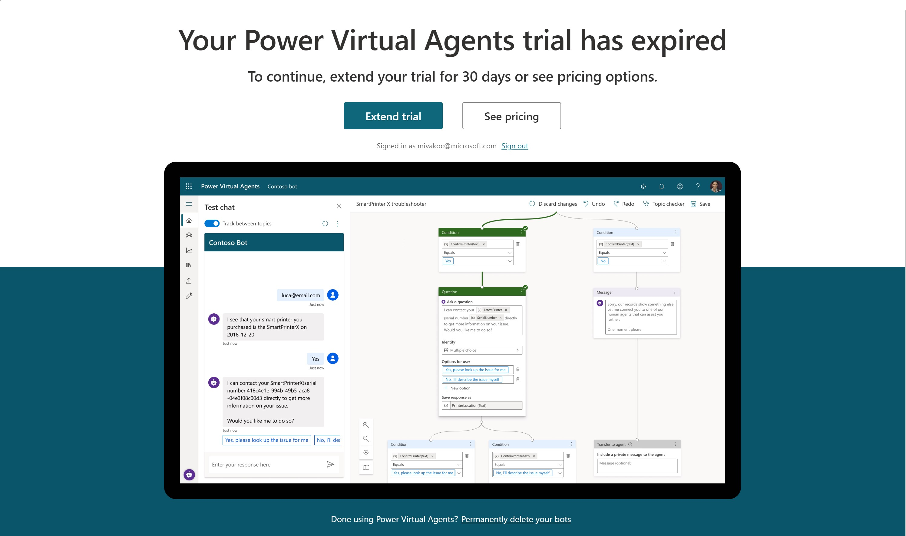
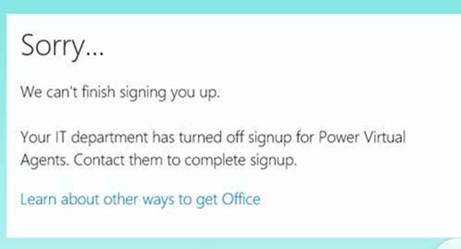

# Sign up for a Power Virtual Agents trial 

This article explains how you sign up for Power Virtual Agents on an individual basis. If you're an admin, see [Assign user licenses and manage access to Power Virtual Agents](requirements-licensing.md).

Follow the instructions below to sign up for a trial of Power Virtual Agents. After you complete the process,, you can use Power Virtual Agents to create and publish bots. 

1. Go to the [sign-up page](https://go.microsoft.com/fwlink/?LinkId=2107702).

2. Enter your email address and then select **Sign up**.

> [!div class="mx-imgBorder"]
> 

You'll then be taken to the Power Virtual Agents log in page and you can start using your account.

## Prerequisites

- [!INCLUDE [Medical and emergency usage](includes/pva-usage-limitations.md)]

## Trial expiration
> 

After you finish the log in process, your time-limited free trial for Power Virtual Agents begins. You should recieve a notification message and a confirmation email to inform you about the trial expiry. When the trial expires, you'll be able to extend the trial by 30 days. 

> 

> [!NOTE]
> Your bot will continue to work for up to 90 days after your trial has expired so you don't have to worry about extending at the exact time of expiry. 

## Troubleshooting the sign-up process
In most cases, you can sign up for Power Virtual Agents using the steps in this article. Some issues might prevent you from signing up. 

### Personal email address 
You can't sign up for Power Virtual Agents using a personal email address. You must use a work or school account to finish the process.

### Self-service sign up disabled
If you receive a message that your sign-up couldn't be completed, it means your organization's IT administrator has disabled self-service sign up for Power Virtual Agents. To finish signing up, contact your IT administrator and ask them to follow the instructions to [enable sign-up](requirements-licensing.md#trial-plans).

> [!div class="mx-imgBorder"]
> 

[!INCLUDE[footer-include](includes/footer-banner.md)]