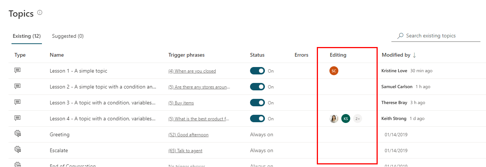
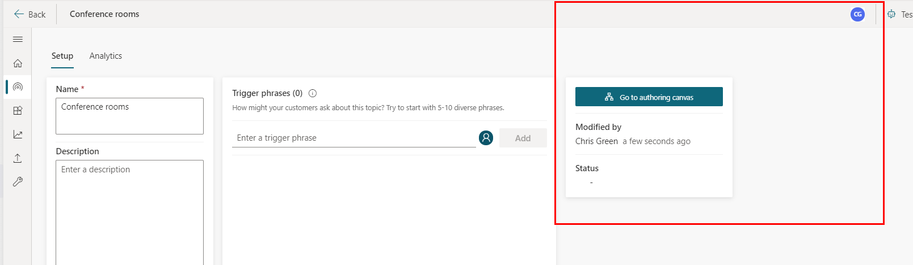
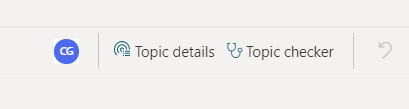

# Collaborate with others 

Select the version of Power Virtual Agents you're using here:

> [!div class="op_single_selector"]
> - [Power Virtual Agents web app](../admin-share-bots.md)
> - [Power Virtual Agents app in Microsoft Teams](admin-share-bots-teams.md)

You can collaborate with others when building chatbots in Microsoft Teams. This means other members of your team can make edits and changes, and you can see who else is editing a topic.

Your permissions are determined by your [Microsoft Teams roles](/microsoftteams/assign-roles-permissions) in the team where your bot is created: 

- Team Owners can create, view, edit, and configure all bots in the team where they are Team Owners. 
- Team Members can create, edit, and configure bots they have created. They can view other member's bots in the team.

>[!NOTE]
>If you are an owner of an Azure Active Directory group associated with a team, but you are not also a member of that group, you might not see the team in the Power Apps and Power Virtual Agents apps in Microsoft Teams.  
>You can add yourself as a member to the team and it will resolve the issue after a few minutes.

## Share bots

Everyone on your team has access to the bots you create. 

To share your bot with other users, you need to [add them to your team](https://support.microsoft.com/office/add-members-to-a-team-in-teams-aff2249d-b456-4bc3-81e7-52327b6b38e9).

>[!NOTE]
>It could take up to 15 minutes before the new team member sees the team in the Power Virtual Agents app.

You can see a list of the teams you belong to, and each bot within that team by going to the **Chatbots** tab on the top navigation bar. Teams are listed on the left, selecting a team shows the chatbots in that team. Whereever you are in the app, you can always get back to the list of chatbots by selecting **Chatbots** at the top.

>[!TIP]
>**My chatbots** shows all the bots you created and is an easy way for you to find your bot across multiple teams. You can find bots created by other team members by selecting the team.

:::image type="content" source="media/admin-share-bots-list.png" alt-text="The teams and chatbots are listed in the Chatbots tab":::

You can open bots for editing by selecting the bot's name.

If you select the check mark next to the bot's name, you can go straight to the Topics or Analytics page for that bot. You can also select **Edit** to go to the bot's homepage.

:::image type="content" source="media/admin-share-bots-edit.png" alt-text="The Topics and Analtyics buttons appear when a bot is selected":::

If you select the menu icon next the bot's name you can then select **Edit** to go to the bot's homepage, or go to the Topics or Analytics pages.

:::image type="content" source="media/admin-share-bots-hamburger.png" alt-text="The bot's menu lets you edit details, topics, and see analytics":::

If you rename, restore, or delete a team, it could take up to 2 hours for the changes to be reflected in the Power Virtual Agents app.

## Collaborate on bots

In the **Topics** list, you can see who's working on a topic under the **Currently editing** column. You can hover or click on the person's icon to quickly chat with them in Teams or send them an email. 

This can help prevent conflicts if multiple people are working on the same topic.

>[!NOTE]
>The list of authors in the **Currently editing** column is only refreshed when the page is loaded.

A topic's **Details** page also shows all the people currently editing a topic, as well as the last time someone saved.

A list of who's editing the page also appears as user icons on the top of the authoring canvas when you've opened a topic for editing.

After 30 minutes of inactivity you will not be identified as editing the topic.

Occasionally, multiple people might make changes to a topic and attempt to save their changes at the same time.

Power Virtual Agents will detect this and prevent you from overwriting your coworker by prompting you with an option - you can reload the content with the latest changes (discarding your work), or you can save a copy of the topic (keeping your changes in a new, duplicate copy of the topic). 

If you save your changes to a new topic, you can then review your coworker's changes and merge the two topics, deleting the copy of the topic once you've finished.
