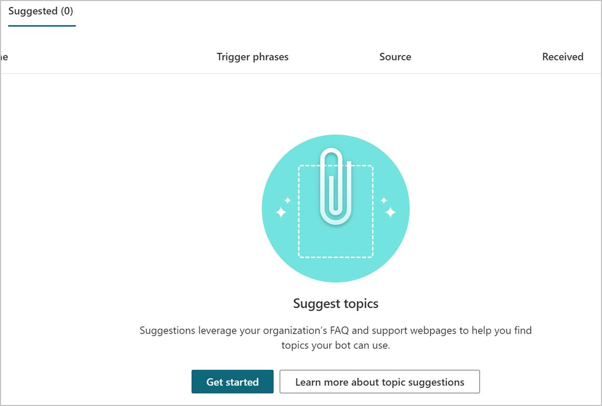

# Create topics from existing online support content in Teams

Select the version of Power Virtual Agents you're using here:

> [!div class="op_single_selector"]
> - [Power Virtual Agents web app](../advanced-create-topics-from-web.md)
> - [Power Virtual Agents app in Microsoft Teams](advanced-create-topics-from-web-teams.md)

You can import existing help text and automatically create topics for a chatbot, so you don't have to re-create lots of questions and answers.

For example, imagine you already have an FAQ page (like [this one for Microsoft Search](/microsoftsearch/faqs)) and you just want to put these common questions into your bot. Or you might have something similar, but stored in a Word or Excel file.

Instead of having to manually copy each question and its answer and create new topics in your bot for each question, you can get Power Virtual Agents to do all this for you automatically.

All you need is a secure link (one that starts with https://) to the file or webpage that has the questions you want to import.

## Prerequisites

- [!INCLUDE [Medical and emergency usage](includes/pva-usage-limitations-teams.md)]

## Get content from webpages and online files

First you'll need a secure URL (starting with HTTPS) to your content, which must be a publicly available link. For example, you can use a publicly-shared OneDrive .xlsx file, but you can't use a file on a SharePoint site or somewhere where you need to log in.

After the extraction is complete, you'll be shown the suggested topics for further review. Suggested topics aren't automatically added to your bot, but you can [easily add them](#add-suggested-topics-to-an-existing-bot).

>[!IMPORTANT]
>The **Suggest topics** command is built to run on webpages that are in the form of FAQ pages or support sites. Other types of pages that don't have that structure might not work as expected.

**To extract content from existing webpages**

1. Select **Topics** on the side navigation pane.

    :::image type="content" source="media/topics-web-tab.png" alt-text="The Topics menu item on the navigation pane":::

2. Go to the **Suggested** tab. 

3. If it's the first time you're getting suggestions, the list of suggested topics will be blank. A link to **Get started** or **Learn more** appears instead.

    

4. Select **Get started** or **Suggest topics**. 

5. Enter each webpage or file you want to extract content from, and then select **Add**. The URLs must be secure (they must start with *https://*). If you add a page by mistake, you can remove it by selecting **Delete** .

    

7. When you're done adding pages, select **Start**. The message "Getting your suggestions. This may take several minutes" appears at the top of the screen while the extraction is in progress.

    :::image type="content" source="media/suggested-web-wait-teams.png" alt-text="An alert that says Getting your suggestions. This may take several minutes appears at the top of the page":::

>[!TIP]
>You can add multiple webpages, but we recommend that you include only a few at a time to keep the list of suggestions manageable.

>[!IMPORTANT]
>You won't be able to add more URLs while the **Suggest topics** feature is running.

Now the suggested topics will appear. These were all taken from the links you submitted. 

## Add suggested topics to an existing bot

You can now review these suggestions to see what to add to your bot.

**To review suggestions and add them to your bot**

1. Select the name of the suggested topic.  

2. Check the phrases and words that will cause the bot to start talking about that topic, along with what answer the bot will give. Each topic will end with a survey, so your customers can let you know whether they found it helpful.  
  You have the following three options for dealing with the topic:  

    a. To make edits to the topic, select **Add to topics and edit**. The topic will open, where you can [edit the trigger phrases or enter the authoring canvas](authoring-create-edit-topics-teams.md) to make changes to what the bot says. The topic will also be removed from the list of suggestions.  

    b. To directly add the suggested topic without making any changes, select **Add to topics**. The topic is added and saved. The topic will also be removed from the list of suggested topics.  

    c. To completely remove the suggestion, select **Delete suggestion**. The topic will be deleted from the list of suggested topics. Run the **Suggest topics** command again to restore it.  

    :::image type="content" source="media/suggested-web-add-edit-teams.png" alt-text="n editing window showing a snapshot of the topic's layout":::

You can also delete or add the suggestion without opening the preview:

1. Hover over the name of the suggested topic you want to add or delete. 

1. To delete, select the trashcan icon.
1. To add the topic to your bot, select the **Add to topics** icon . You won't see a preview of the topic, and the topic will be automatically moved to the list of "Existing" topics.

    
    
2. You can also add or delete multiple topic suggestions at a time. If you select multiple rows, you'll see options to **Add to topic** or **Delete**.

    

## Enable topics in your bot

Suggested topics are added to the **Existing** tab with their status set to **Off**. This way, topics won't be added to your bot by accident.

**To enable topics for use**

1. Select **Topics** on the side navigation pane.

2. Go to the **Existing** tab. 

3. For each topic you want to enable, turn on the toggle under **Status**.

    
You can [test the topics in the test chat](authoring-test-bot-teams.md), but you'll need to [publish your bot for customers](publication-fundamentals-publish-channels-teams.md) to see the latest changes.

### See also

[Create your first bot](authoring-first-bot-teams.md)  
[Create and edit topics](authoring-create-edit-topics-teams.md)  
[Fundamentals - Publish your bot](publication-fundamentals-publish-channels-teams.md)
