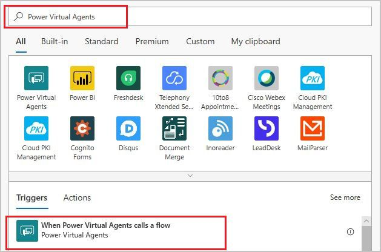
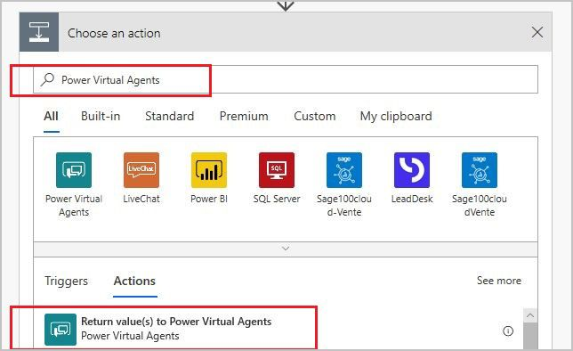

# Add actions to a bot using Power Automate  in Teams

You can enable your bot to perform an action by calling a Microsoft Power Automate flow. Flows can help you automate activities, or call backend systems. For example, you can use flows with [end-user authentication](advanced-end-user-authentication-teams.md) to retrieve information about a user after they've signed in.

Flows typically use variables to input and output information. The variables can then be used in other nodes within the topic.

For example, you could record someone's answer to a question in one place in the bot, then have a flow that "outputs" a special message based on the "input".

## Prerequisites

- [!INCLUDE [Medical and emergency usage](includes/pva-usage-limitations-teams.md)]

## Create a new flow from the Power Virtual Agents authoring canvas 

1. Go to the [**Topics page**](authoring-create-edit-topics-teams.md) for the bot you want to edit.

1. Open the authoring canvas for the topic from which you want to call a flow.

1. Select the plus (**+**) button below an existing node to add a new node. 

1. In the node selection window, select **Call an action**, and then select **Create a flow**. 

    

Using the **Create a flow** option opens a starter flow template in the Power Automate app in Teams, within the Power Virtual Agents app. Select the tile that appears:

:::image type="content" source="media/flow-template-tile.png" alt-text=" ":::

After that, you'll see a blank flow template.

:::image type="content" source="media/PVAConnectorTemplate-teams.png" alt-text="The flow action and response boxes of a flow for Power Virtual Agents":::

This template is an example of a flow that can be used by bots. To be suitable for bots, a Power Automate flow requires a special **Power Virtual Agents** trigger and response action: 

- Flow trigger:  **Power Virtual Agents**  

    

- Response action:  **Power Virtual Agents**  

    

## Input and output parameters

See the [Power Virtual Agents app documentation on flows](../advanced-flow.md) for details on inputs and outputs and restrictions. 

### Input parameters

To specify a flow to accept input parameters from a bot, select the **Add an input** option in the **Power Virtual Agents trigger** user interface, and then select the type a - `string`, `number`, or a `boolean`.

For example, you can select **Text** and **Number** to add the following input parameters to the flow:
- **String_Input** of type `string`
- **Number_Input** of type `number` 

### Output parameters

To return output parameters to the bot that can be a `string`, `number`, or a `boolean`, select **Add an output** option in **Power Virtual Agents response** user interface, and then select the type for the output.

For example, you can select **Text** and **Number** to add the following output parameters to the flow and assign return values for them.
- **String_Output** of type `string`
- **Number_Output** of type `number`

:::image type="content" source="media/PVAConnectorTemplate_SAVE-teams.png" alt-text="Input and output parameters are defined in the flow":::

This example creates a fully functional flow that accepts two parameters, a `string` and a `number`, and returns them to a bot as outputs. 

Select **Save** to save your new flow.

Now when you go to call an action and choose **Flow**, you'll see the flow you created. You can select **More details** to edit the flow, save it, and make other changes.

:::image type="content" source="media/flow-ready.png" alt-text="The flow is now added as a new node with the inputs and outputs that were defined in the flow":::

Your flow is saved to the **Default Solution** under the **Solutions** tab on the Power Automate portal.

>[!WARNING]
>I can't find it on the Power Automate site, not anywhere else. It only shows up again if I choose to call an action > flow. Is there any where else it will show up?

## Create simple flow

In this flow, we're going to provide a special message and email when someone asks about conference rooms.

1. Create a new topic with the trigger phrase "**Is there a conference room available?**". 
2. Add a **Question** node that asks "**How many people are in the meeting?**". By default, it will be set to accept ("identify") multiple choice options - change that to **Number**. At the bottom, click on the variable called "**Var**" and change it to "**Numberguests**"

3. Add a **Question** node that asks "**Do you have any requirements**". By default, it will be set to accept ("identify") multiple choice options - change that to **User's entire response**. At the bottom, click on the variable called "**Var**" and change it to "**Requirements**"

:::image type="content" source="media/flow-test-1.png" alt-text=" ":::

4. Insert a **Call to action** and choose the flow you created. Set the `String_Input` to **Requirements** and the `Number_Input` to **Numberguests**.
5. Now insert a message node with those variables. You could add another flow underneath this emails the information.

 :::image type="content" source="media/flow-test-2.png" alt-text=" ":::

6. Add a **Call an action** node, and select a new flow
 7. In the flow template, enter a string input called "Input_Requirements" and a number input called "Number_Attendees".
8. Add a condition after the input to send an outlook message, and enter the variables in the body. Save the flow and return to the Power Virtual Agents authoring canvas.

:::image type="content" source="media/flow-test-3.png" alt-text=" ":::

9. Add the flow you just created, and select the two variables as the inputs for the flow.

Now when the bot user tells the bot how many people, and any requirements, an email will be sent with that information.

:::image type="content" source="media/flow-test-4.png" alt-text=" ":::

See the [Power Virtual Agents app documentation on using Flows](../advanced-flow.md) for more detailed and complex scenarios using flow.
