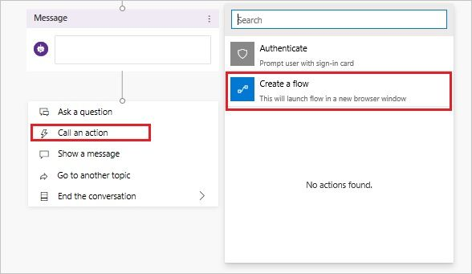

# Add actions to a bot using Power Automate  in Teams

Select the version of Power Virtual Agents you're using here:

> [!div class="op_single_selector"]
> - [Power Virtual Agents web app](../advanced-flow.md)
> - [Power Virtual Agents app in Microsoft Teams](advanced-flow-teams.md)

You can enable your bot to perform an action by calling a Microsoft Power Automate flow. Flows can help you automate activities, or call backend systems. For example, you can use flows to send messages to a Teams channel, or access files in a SharePoint folder.

Flows typically use variables to input and output information. The variables can then be used in other nodes within the topic.

For example, you could record someone's answer to a question in one place in the bot, then have a flow that "outputs" a special message based on the "input".

## Prerequisites

- [!INCLUDE [Medical and emergency usage](includes/pva-usage-limitations-teams.md)]

## Create a new flow from the Power Virtual Agents authoring canvas 

1. Go to the [**Topics page**](authoring-create-edit-topics-teams.md) for the bot you want to edit.

1. Open the authoring canvas for the topic from which you want to call a flow.

1. Select the plus (**+**) button below an existing node to add a new node. 

1. In the node selection window, select **Call an action**, and then select **Create a flow**. 

    

Using the **Create a flow** option opens a template selection screen.

:::image type="content" source="media/flow-template-tile.png" alt-text="Flow template selection screen":::

>[!NOTE]
>Save your topic before creating a new flow, as you will be taken to Power Automate for this operation.

You will find a list of templates which helps you quickly get started creating Power Automate flows. For this example, we will pick the basic "Power Virtual Agents Flow Template". 

After that, you'll see a blank flow template.

:::image type="content" source="media/PVAConnectorTemplate-teams.png" alt-text="The flow action and response boxes of a flow for Power Virtual Agents":::

## Input and output parameters

See the [Power Virtual Agents web app documentation on flows](../advanced-flow.md) for details on inputs and outputs and restrictions. 

### Input parameters

To specify a flow to accept input parameters from a bot, select the **Add an input** option in the **Power Virtual Agents trigger** user interface, and then select the type: a `string`, `number`, or `boolean`.

For example, you can select **Text** and **Number** to add the following input parameters to the flow:
- **String_Input** of type `string`
- **Number_Input** of type `number` 

:::image type="content" source="media/PVATemplateInput.png" alt-text="Input and output parameters are defined in the flow":::

### Output parameters

To return output parameters to the bot that can be a `string`, `number`, or a `boolean`, select **Add an output** option in **Power Virtual Agents response** user interface, and then select the type for the output.

For example, you can select **Text** and **Number** to add the following output parameters to the flow and assign return values for them.
- **String_Output** of type `string`
- **Number_Output** of type `number`

:::image type="content" source="media/PVAConnectorTemplate_SAVE-teams.png" alt-text="Input and output parameters that were added are now saved":::

This example creates a fully functional flow that accepts two parameters, a `string` and a `number`, and returns them to a bot as outputs. 

Select **Save** to save your new flow.

Now when you go to call an action and choose **Flow**, you'll see the flow you created. You can select **View flow details** to edit the flow, save it, and make other changes.

:::image type="content" source="media/flow-ready.png" alt-text="The flow is now added as a new node with the inputs and outputs that were defined in the flow":::

## Create simple flow

In this flow, we're going to provide a special message and email when someone asks about conference rooms.

1. Create a new topic with the trigger phrase "**Is there a conference room available?**". 
2. Add a **Question** node that asks "**How many people are in the meeting?**". By default, it will be set to accept ("identify") multiple choice options - change that to **Number**. At the bottom, click on the variable called "**Var**" and change it to "**Numberguests**".

3. Add a **Question** node that asks "**Do you have any requirements**". By default, it will be set to accept ("identify") multiple choice options - change that to **User's entire response**. At the bottom, click on the variable called "**Var**" and change it to "**Requirements**".

:::image type="content" source="media/flow-test-1.png" alt-text="Add a question node to canvas":::

4. Insert a **Call to action** and choose the flow you created. Set the `String_Input` to **Requirements** and the `Number_Input` to **Numberguests**.
5. Now insert a message node with those variables. You can now add another flow that emails the information.

 :::image type="content" source="media/flow-test-2.png" alt-text="Insert message node in canvas":::

6. Add a **Call an action** node, and select a new flow.
7. Pick the first flow template (Power Virtual Agents Flow Template).
8. In the flow template, enter a string input called **Input_Requirements** and a number input called **Number_Attendees**.
9. Add an Outlook connector after the input to send an Outlook message, and enter the variables in the body. Save the flow and return to the Power Virtual Agents authoring canvas.

:::image type="content" source="media/flow-test-3.png" alt-text="Send a message via Outlook connector":::

10. Add the flow you just created, and select the two variables as the inputs for the flow.

Now when the bot user tells the bot how many people, and any requirements, an email will be sent with that information.

:::image type="content" source="media/flow-test-4.png" alt-text="Complete topic with a flow call that sends email via Outlook connector":::

See the [Power Virtual Agents app documentation on using Flows](../advanced-flow.md) for more detailed and complex scenarios using flows.
