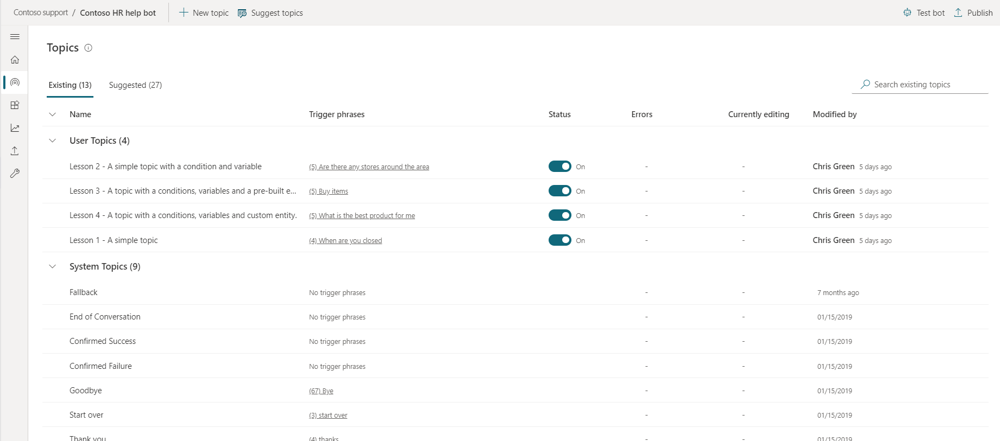
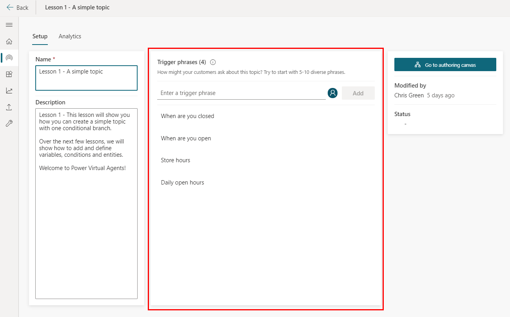
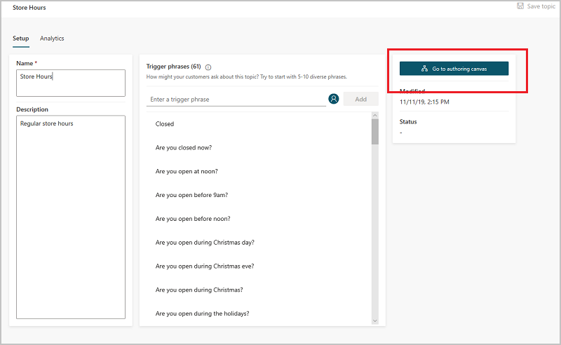
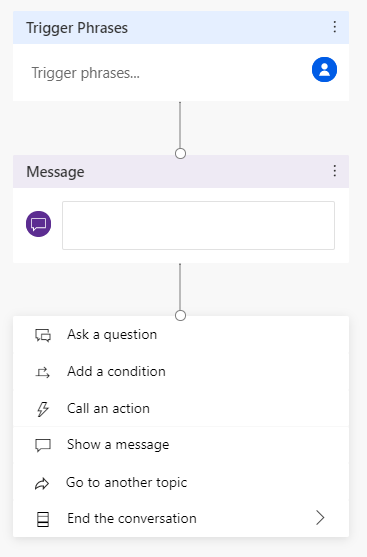
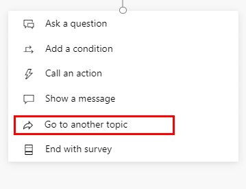
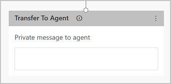

# Create and edit topics in your Power Virtual Agents bot

In Power Virtual Agents, a topic defines a how a bot conversation plays out. 

You can author topics by [customizing provided templates](authoring-template-topics-teams.md), create new topics from scratch, or [get suggestions from existing help sites](advanced-create-topics-from-web-teams.md). 

A topic has trigger phrases—these are phrases, keywords, or questions that a user is likely to type that is related to a specific issue —and conversation nodes—these are what you use to define how a bot should respond and what it should do.

The AI uses natural language understanding to parse what a customer actually types and find the most appropriate trigger phrase or node. 

For example, a user might type "Open hours" into your bot—the AI will be able to match that to the **Store hours** topic and begin a conversation that asks which store the customer is interested in, and then display the hours the store is open.

You can see how the bot conversation works in practice by testing it in the **Test bot** pane. This lets you fine-tune the topic until you are ready to deploy it without having to exit the Power Virtual Agents portal.

> [!Note]
> You can have up to 1,000 topics in a bot.

## Prerequisites

[!INCLUDE [Medical and emergency usage](includes/pva-usage-limitations-teams.md)]

## Use system and sample topics

When you create a bot, a number of topics will be automatically created for you.

> [!div class="mx-imgBorder"]
> 

These are:
  
  - Four prepopulated **User Topics** that are titled as lessons. These [lesson topics](authoring-template-topics-teams.md) can be used to help understand simple to complex ways of using nodes to create bot conversations.
  - A number of **System Topics**. These are prepopulated topics that you are likely to need during a bot conversation. We recommend you keep these and use them until you are comfortable with creating an end-to-end bot conversation.

You can edit both of these topic types in the same manner as for topics you create; however, you cannot delete them.

## Create a topic

1. Go to the **Topics** tab on the side navigation pane to open the topics page.

   > [!div class="mx-imgBorder"]
   > 

1. On the topics page, select **New topic**.

   > [!div class="mx-imgBorder"]
   > 

1. Specify a name, description, and one or more trigger phrases for the topic.

   A trigger phrase is a phrase that a customer enters in the chat window to start a conversation with the bot. Once the conversation is started, the conversation follows the path you define. You can specify more than one trigger phrase for a topic. You can include punctuation in a trigger phrase, but it is best to use short phrases rather than long sentences.

   > [!div class="mx-imgBorder"]
   > 

1. Select **Save topic** to add the topic to the topics list.

## Design the topic's conversation path

1. In the topic details for the topic you want to edit, select **Go to authoring canvas**.

   

1. Power Virtual Agents opens the topic in the authoring canvas and displays the topic's trigger phrases. The authoring canvas is where you define the conversation path between a customer and the bot.

 
1. For existing or system topics, a number of nodes will automatically be created. You can edit these nodes just as you can for other nodes.

1. When you create a new topic, a **Trigger phrases** node and a blank **Message** node are inserted for you. 

1. You can add additional nodes by selecting the **Plus** (**+**) icon on the line or branch between or after a node.

   > [!div class="mx-imgBorder"]
   > 

### Insert nodes

When adding a node, you can choose from five options. Each option has a specific node or nodes that will be inserted into the conversation path.

You can:

- **Ask a question**
- **Call an action**
- **Show a message**
- **Go to another topic**
- **End the conversation**

  > [!div class="mx-imgBorder"]
  > 
 
Additionally, you can **Branch based on a condition** when inserting a node between existing nodes:

> [!div class="mx-imgBorder"]
> 

#### Ask a question:

1. To have the bot ask a question and get a response from the user, select **+** to add a node, and then **Ask a question** to add a new **Question** node.

   > [!div class="mx-imgBorder"]
   > 

1. Enter the question phrase in the first text box, **Ask a question**.

1. You can choose from several options for the user’s response in the **Identify** field. 
   
   These options determine what the bot should be listening for in the user's response. 
   
   For example, they could be multiple choice options, a number, or a specific string. 
   
   To understand more about the different options in this flyout, see [Use entities in a conversation](advanced-entities-slot-filling-teams.md#use-entities-in-a-conversation).

1. Depending on what you choose in the **Identify** field, you can enter what options the user should have. 
   
   For example, if you select **Multiple choice options**, you can then enter the options the user can specify in the **Options for user** field. Each option is presented as a multiple choice button to the user, but users can also type in their answer in the bot.

   The conversation editor creates separate paths in the conversation, depending on the customer's response. The conversation path leads the customer to the appropriate resolution for each user response. You can add additional nodes to create branching logic, and specify what the bot should respond with for each variable.

1. You can [save the user response in a variable](authoring-variables-teams.md) to be used later. 

> [!TIP]
> You can define synonyms for each option. This can help the bot to determine the correct option in case it isn't clear what the user's response should be mapped to.
> 1. Select the menu icon on the top of the **Question** node, and then select **Options for user**.
>
>    
>
> 1. Select the **Synonyms** icon for the option you want to add additional keywords to. 
>
>    
>
> 1. Add the keywords individually, and then once you're done, select **Done** to return to the **Authoring canvas**.

#### Call an action

You can [call Power Automate Flows](advanced-flow-teams.md) by selecting **Call an action**.
 

#### Show a message

1. To specify a response from the bot, select **+** to add a node, and then **Show a message** to add a new **Message** node.

1. Enter what you want the bot to say in the text box. You can apply some basic formatting, such as bold, italics, and numbering. 
   
   You can also [use variables that you have defined elsewhere](authoring-variables-teams.md) in your bot conversation.

#### Go to another topic

1. To automatically have the bot move to a separate topic, select **+** to add a node, and then **Go to another topic**.

1. In the flyout menu, select the topic the bot should divert to. For example, you might want to send the user to a specific topic about the closure of a store if they ask about store hours for that store.

    > [!div class="mx-imgBorder"]
    > 

#### End the conversation

When you end the conversation, you can have a survey appear that asks the user if their question or issue was answered or resolved correctly. This information is collected under the [customer satisfaction analytics page](analytics-csat-teams.md).

You can also have the conversation [handed over to a live agent](advanced-hand-off-teams.md) if you're using a suitable customer service portal, such as Omnichannel for Customer Service.

1. At the end of a response that resolves the user's issue or answers the question, select **End the conversation**.

    > [!div class="mx-imgBorder"]
    > 

1. To end with a customer satisfaction survey, select **End with survey**.
    
    > [!div class="mx-imgBorder"]
    > 

1. Select **Transfer To Agent** to insert a hand-off node that will link with your [configured hand-off product](configuration-hand-off-omnichannel-teams.md). You can also enter a private message to the agent.

    > [!div class="mx-imgBorder"]
    > 

#### Branch based on a condition

1. To add branching logic based on [variables](authoring-variables-teams.md), select **+** to add a node, and then **Add a condition** and **Branch based on a condition**.

1. Choose the variable you want to use to determine if the bot conversation should branch at this point. For example, if you have set up [end-user authentication](advanced-end-user-authentication-teams.md), then you might want to specify a different message if the user is signed on (which may have happened earlier in the conversation).

    > [!div class="mx-imgBorder"]
    > 

### Delete nodes

1. Select the menu icon on the top of the node's title.

1. Select **Delete**.

    > [!div class="mx-imgBorder"]
    > 

## Test and publish your bot

[Test your bot](authoring-test-bot-teams.md) when you make changes to your topics, to ensure everything is working as expected.

Once you've finished designing and testing your bot, you can consider [publishing it to the web, mobile or native apps, or Microsoft Bot Framework channels](publication-fundamentals-publish-channels-teams.md).

