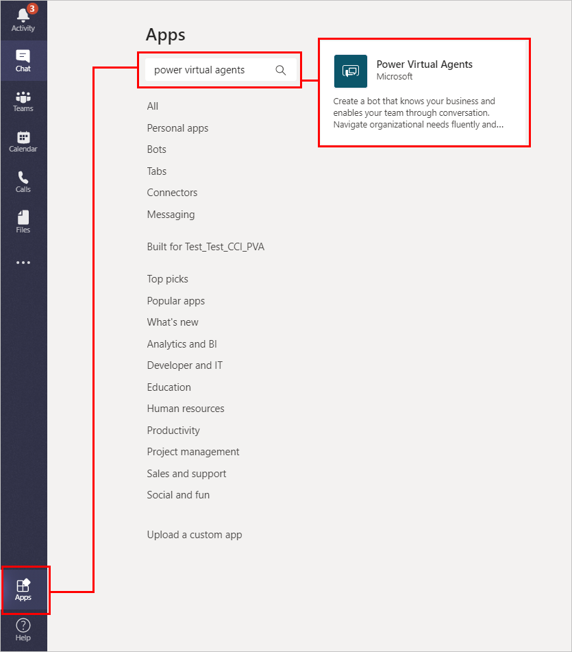
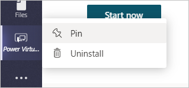
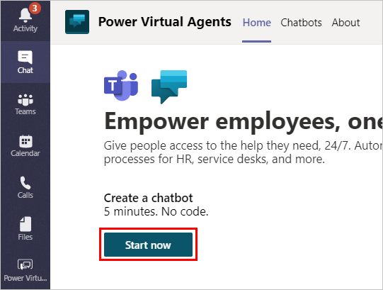
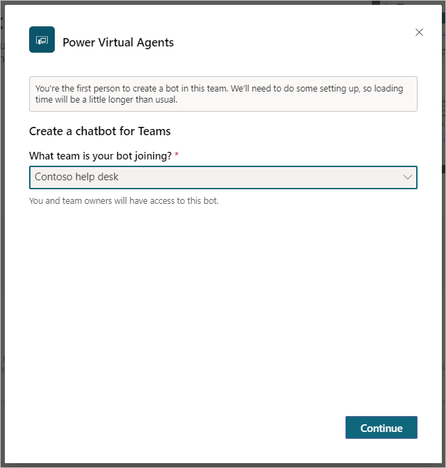
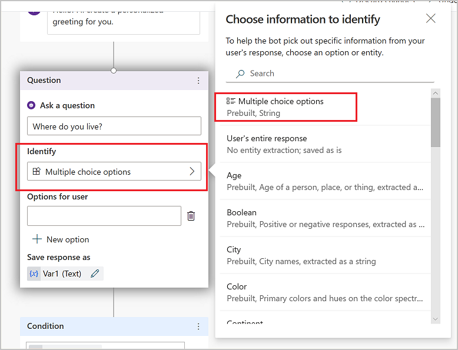
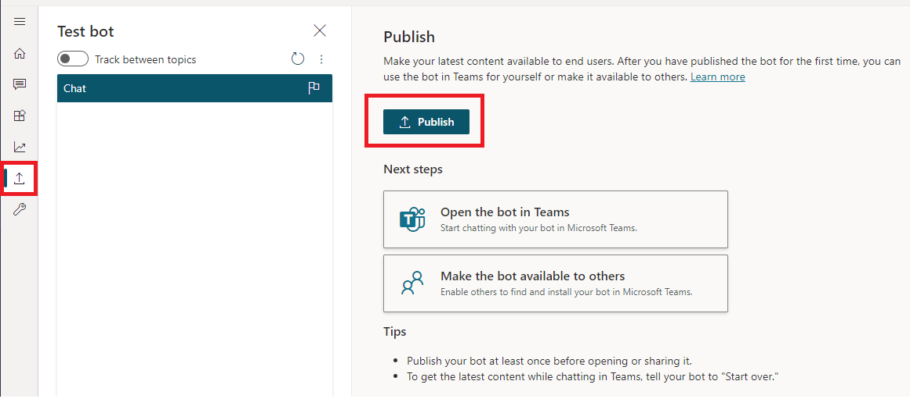
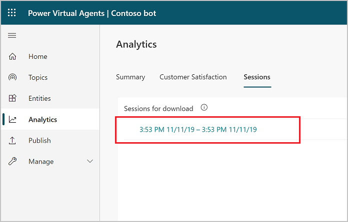

# Quickstart: Create and deploy a Power Virtual Agents bot in Teams

Select the version of Power Virtual Agents you're using here:

> [!div class="op_single_selector"]
> - [Power Virtual Agents web app](../fundamentals-get-started.md)
> - [Power Virtual Agents app in Microsoft Teams](fundamentals-get-started-teams.md)

[!INCLUDE [cc-beta-prerelease-disclaimer](includes/cc-beta-prerelease-disclaimer-teams.md)]

Create, manage, and publish conversational chatbots easily from within Teams. Share your bots with other people in your organization so they can chat and have their questions answered.

You can start by creating a simple bot, or create a ready-made bot based on standard frequently asked questions (FAQs).

Chatbots revolve around two concepts:

- Questions that someone asks it
- Answers that the bot provides

When you create chatbots, you need to think about the sorts of questions someone might ask it, the different ways they might ask the question, and what the answer should be. You should also consider if the person has follow-up questions or concerns.

## Prerequisites

- [!INCLUDE [Medical and emergency usage](includes/pva-usage-limitations-teams.md)]

## Create your first bot

1.	Open Microsoft Teams and select **Apps** at the bottom of the side navigation pane.
2.  Under **Apps**, in the search bar, search for *Power Virtual Agents*, and select the tile that appears.

    

3. Right-click on the Power Virtual Agents tab, and select **Pin** to make it easier to get back to the app if you navigate away.

    

3. Select **Start now** on the **Home** tab.

    

4. Select the team for your bot, and then **Continue**. Only members of that team will be able to see or interact with the bot. You might want to [create a new team](/MicrosoftTeams/get-started-with-teams-create-your-first-teams-and-channels) and make sure it is public if you want everyone in your organization to access it.

    

    >[!NOTE]
    >If you're the first person to create a bot in the team you choose, it will take a little bit longer to create and set up the bot. You'll see a notice describing this when you choose your team.

    A loading screen will show up. You can close the screen while things are being set up, so you can keep using Teams. When your bot is ready, you'll see an alert.

    You can also create a bot by going to the **Chatbots** tab, selecting the team you want to use, and then **New chatbot**.

   
   

## Create a topic

1.	Now that you have full functionality within your bot, you can create your own topic—or, in other words, a dialog tree specifying how your bot responds to a user's question.

2.	Start by selecting **Topics** in the side navigation pane, and then select **New topic** at the top of the page.

    
    

3. You can now name your topic and include some trigger phrases for this topic. Trigger phrases are examples of the type of user questions or utterances that help teach the bot when to respond with this dialog. 
    

   As an example, let's create a topic called 'Personal Hello World' and add 'hello world' as a trigger phrase. Select **Save topic** to add the topic to the topics list.
    
    

4. After saving your topic, select **Go to authoring canvas**. This is the graphical dialog tree editor that allows you to define bot responses and the overall bot conversation.

   Start by entering 'Hello! I'll create a personalized greeting for you.' into the first **Message** node. 
   
    
    

    

5. Then, click on the **+** below the node, and add an **Ask a question** node by selecting it in the menu. Enter the question text, 'Where do you live?', in the **Ask a question** box. To give the customer a choice between different responses, select **Multiple choice options** under **Identify**.
    
    

6. Add two options for the user, by selecting **+ New option**. Enter 'Seattle' and 'Bellevue' in the text boxes called 'Options for user'. Each option is presented as a multiple choice button to the user.

    The authoring canvas creates separate paths in the conversation, depending on the customer's response. The conversation path leads the customer to the appropriate resolution for each user response.

    

7. In the forked conversation path, each node has automatically checked for 'Seattle' in one path, and 'Bellevue' in the other path to take the appropriate next step.

8. Finally, click the **+** below each of the Condition nodes to add a **Message** node in each branch. Add a simple message like 'Hello Seattle!' in the Seattle branch, and 'Hello Bellevue!' in the Bellevue branch. Select **Save** at the top.

    
    

You now have a very simple branching dialog tree, congratulations! You can begin to create more complex versions of this tree by incorporating [variables](authoring-variables-teams.md), [entities](advanced-entities-slot-filling-teams.md), and [Power Automate flows](advanced-flow-teams.md).

 
## Test your content in real time

1. Now that you have some content authored into a dialog tree, it's time to test this out in real time to see if it's working as you expected. For this, you'll use the test bot panel.

    
    
      
      
    If the test bot is not showing on your screen, select **Test your bot** at the bottom of the side navigation pane.

    

  
2. You can try out your newly authored dialog tree by typing into the test bot window. Turn on **Track between topics** at the top, which enables you to follow along with the bot as it executes your dialog. You'll start to see parts of your dialog tree highlighted as the bot gets to that portion of the dialog.

    
   

3. Type "hello world" in the chat window, and send the message to the bot. You'll see the top portion of your dialog tree highlighted in green, and you'll see **Seattle** and **Bellevue** presented as user options in the test bot window.
The bot is now waiting for you to respond and has provided suggestions on how to respond. These suggestion buttons reflect what you authored within your dialog tree in the 'Ask a question' node. In the test bot, you can either select these suggestion buttons to continue, or you can enter your response into the chat window. 

    
    
     

4. You can continue the dialog by selecting the Seattle branch. You'll see the chat stop once you've reached the bottom of this branch. If you author more content, the dialog will continue, but since we've only created a very simple and small dialog tree, we can reach the end of the content very quickly.

    This test experience empowers you to quickly create and test a conversation to ensure that the conversation will flow as anticipated. If the dialog does not reflect your intention, you can change the dialog, and save it. The latest content will be pushed into the test bot, and you can try it out again. None of this changes the published version of the bot, so feel free to play around with your content until you are happy with it.
 

## Publish your bot

1. Once you are fine with the content authored in your bot, you can publish your bot to a website. Start by selecting the **Publish** tab in the side navigation pane.

    
    
 
2. Select **Publish** to activate your bot with a single click. If the publish is successful, a green banner on the top of the page will indicate so.

 
3. Then click on the demo website link under **Share your bot** to see it in action on a demo website. A new window opens in your browser. If this doesn't happen automatically, check whether a pop-up blocker has been activated and, if so, allow the window to be opened. Usually, you can allow pop-ups from the URL field directly. This is a webpage that demonstrates what your bot looks like to an end-user who comes to your webpage. The bot canvas is at the bottom. You can interact with it by typing into the window or by selecting a starter phrase from the provided options. This is your bot in action. 

    
    

For more information on publishing your bot to other channels, see the documentation under [Publication key concepts](publication-fundamentals-publish-channels-teams.md). 

## Analyze the performance of your bot

1.	Once your bot has completed interactions with users, the statistics are available on the **Analytics** tab in the side navigation pane. Here, you can find key performance indicators (KPIs) showing the volume of sessions your bot has handled, how effectively your bot was able to engage end-users and resolve issues, escalation rates to human agents, and abandonment rates during conversations. You will also find customer satisfaction information at the KPI level as well as in the **Customer Satisfaction** tab.

    > [!NOTE]
    > There is up to a 1-hour delay between when the conversations occur and when the statistics for those conversations appear in the analytics views. Also, all interactions with the bot are logged in analytics, including interactions from your demo website, custom website, or test bot.

2.	You can also view detailed session history and transcripts by selecting **Sessions** from the **Analytics** tab. This enables you to download a CSV file with the full session transcript. This can be a helpful way for you to tune the performance of your bot and change the content in your topics to improve your bot's efficiency.

    
    

    For more information, see [Analytics key concepts](analytics-overview-teams.md).
    
## Conclusion

You've now created a bot, created your own topic, tested it out, published it to a demo website, and learned how to analyze your bot's performance. Congratulations! Your bot has many capabilities beyond this, so please try it out and play with the advanced features.

For questions not covered in the product documentation or for feature ideas, please [visit our community](https://aka.ms/PowerVirtualAgentsForum) and post questions.

We would also like to hear your ideas on Power Virtual Agents. Please [visit our Ideas board](https://aka.ms/PowerVirtualAgentsIdeas) and post your ideas.
