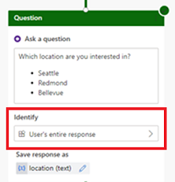

## Known limitations
| Description | Limitation |
| :--------- | :--------- |
| **Other publication channels:** Support for hand-off to a live agent across multiple publication channels (such as Teams, Facebook, web). | Each channel deals with hand-off in their own unique way. The Omnichannel for Customer Service hand-off experience must leverage an engagement hub that supports Omnichannel for Customer Service. |
| **Adaptive cards:** An adaptive card is a customizable card that can contain any combination of text, speech, images, buttons, and input fields. | Power Virtual Agents supports adaptive cards for CSAT surveys.
| **Typing:** A bot receives a typing activity to indicate that the user is typing a response. A bot may send a typing activity to indicate to the user that it is working to fulfill a request or compile a response. | Typing indicators will not appear.
| **Suggested actions:** Suggested actions enable your bot to present buttons that the user can tap to provide input. Suggested actions appear close to the composer and enhance user experience. They enable the user to answer a question or make a selection with a simple tap of a button, rather than having to type a response with a keyboard.|Unlike buttons that appear within rich cards (which remain visible and accessible to the user even after being tapped), buttons that appear within the suggested actions pane will disappear after the user makes a selection. This prevents the user from tapping stale buttons within a conversation and simplifies bot development (since you will not need to account for that scenario).   When you configure the topics for your bot, we recommend not using suggested actions. In the **Identify** field, do not use multiple-choice options and instead select **User's entire response**.  

