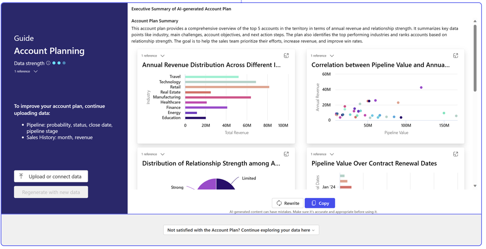

# Account planning guide (preview)

[This article is prerelease documentation and is subject to change.]

Use the account planning guide in Project "Sophia" to help generate account plans and meet your revenue goals.

> [!NOTE]
> Data strengths indicator is a useful tool for gaining insight into data and improving outcomes. Its purpose is to assist users who are unsure where to begin by providing guidance on which data to use for optimal results. The data indicator shouldn't be viewed as the sole source of data or the only data that should be provided.

1. Go to [https://projectsophia.microsoft.com]( https://projectsophia.microsoft.com).
1. From the **Home** screen, select **Guides** > **Account planning**.
1. To get relevant results, select **Domains** located at the top right and choose a specific domain.
1. Select **Add data** and then select one of the following options:
   - Connect to data from **Dataverse**, or **Dynamics 365 Sales**
   - **Upload files**
    > [!IMPORTANT]
    > You need to have an account with the data source to establish a connection to it. For more information, go to [Connect to your data](data-connections.md).
    
1. When your data loads, select **Generate**.

Project "Sophia" generates a tailored account plan based on your data. You can upload or connect to more data and refine your account plan or continue exploring your data.

> [!div class="mx-imgBorder"]
> 
