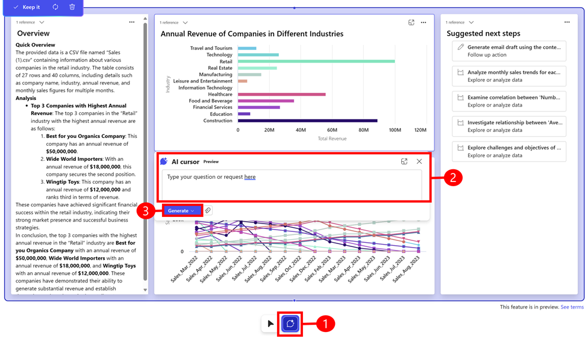

# Ask questions using the AI cursor (preview)

[This article is prerelease documentation and is subject to change.]

The AI cursor provides a way for you to interact with the data that’s generated or ask a new question. It responds to natural language commands and provides contextual recommendations as you navigate the content. Use the AI cursor to ask questions about the content on a blueprint or a block of content in the blueprint.

When content is generated, follow these steps to use the AI cursor:

1. Select the AI cursor or use the keyboard shortcut **Alt + C**.
2. Select an area or block of content to ask a question about and enter your question.
3. Select **Generate** > **Generate as new blueprint** to create a new blueprint, or **Generate in place of existing block** to regenerate content in the selected block. Pressing **Enter** instead of manually selecting one of the two options will always generate a new blueprint. 

> [!TIP]
> - **Update an existing block**: If you experience unexpected results, you can ask Project "Sophia" to adjust the results. For example, update an existing block to use another chart type, group by something else, or explain what an acronym means in your source data to help get better results. When you press **Enter** it generates a new blueprint instead of updating an existing block on the current blueprint.
> - **Add data**: You can upload additional data to an existing workspace at any time using the AI cursor.
   
   > [!div class="mx-imgBorder"]
   > 

## Journey lines

As you explore a subject in depth, it can be beneficial to review the questions you asked along the way during your research journey. This can provide you with a clearer comprehension of what led you to the conclusion of your research journey.

As you ask questions, journey lines display the questions that you asked. By zooming out to view an overview of all your blueprints, you can use the journey lines to see the path that led to your conclusion.

:::image type="content" source="media/journey.png" alt-text="Journey lines":::