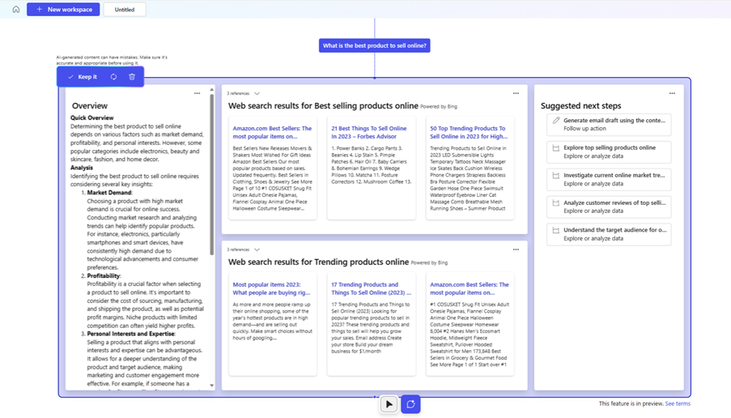
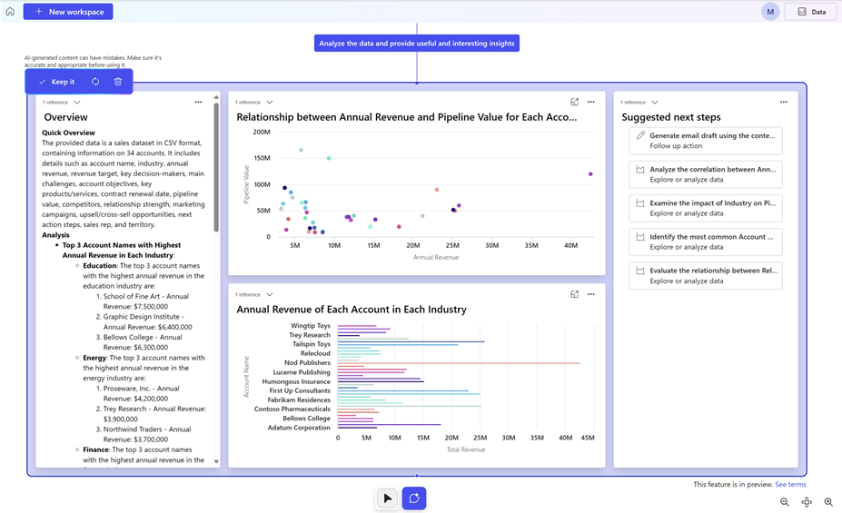

# Explore a topic (preview)

[This article is prerelease documentation and is subject to change.]

When you can ask Project "Sophia" a question or upload data and ask questions about your business data it generates a AI-powered blueprint.

## Ask a question

1. Go to [https://projectsophia.preview.microsoft.com](https://projectsophia.preview.microsoft.com).
2. From the Home screen select **New workspace**.
3. Enter your question in the text box and then select **Generate**.

You'll get more information about your question including a an overview and suggested next steps.

> [!div class="mx-imgBorder"]
> 

## Ask questions about your data

You can upload a data file and ask questions about the data. The [supported file formats](ask-question.md#supported-data-files) are .csv, .xlsx, and .pdf. For preview, the **connect to data** option isn’t available.

1. Use one of the following methods to ask questions about your data:
   - From the Home screen, on the **Onboarding** section, select **Go** > **Exploratory** > **upload data or use sample data**. You can also use the sample sales data provided to familiarize yourself with Project "Sophia".
   - From the Home screen select, **New workspace** > **Upload or connect to data** > **Upload a file**.
2. Select the file name and then select **Open**.
3. Select **Generate** or enter your question in the text box and then select **Generate**.

Your data is analyzed to create a customized template that provides valuable insights, charts, and actionable steps.

> [!div class="mx-imgBorder"]
> 

### Supported data files

You can upload a PDF (.pdf), CSV (.csv), and Excel (.xls) file. The following limitations apply to file uploads:

- The maximum supported file size is 10mb.
- For .csv (comma-separated values) files, the data within the file must be separated by commas. 
- Excel:
  - Column header in the first row only
  - No more than 10 tables and max 50 columns for each table
  - Can’t contain merged cells
  - Elements such as images, charts and macros will not be processed
- PDF:
  - The file must contain selectable text. You can test this by trying to highlight text within the PDF. If you can’t select or highlight the text, then it won’t be processed.
  - Use original digital documents or PDF that is converted directly from word processors or other digital sources. A scanned PDF won’t work.
-	Encrypted or password-protected files aren’t supported 

### Work with content

When content is generated, you can take the following actions:

> [!div class="mx-imgBorder"]
> 

Legend:

1. **Home**: Go to the Home screen.
1. **New workspace**: Opens a blank canvas where you can explore and [ask questions](ask-question.md) related to your business. Or you can upload business data and [ask questions about the data](ask-question.md#ask-questions-about-your-data). When you ask a question a workspace is created that you can access from the Home screen.
1. **Workspace name**: To rename a workspace select the default name **Untilted** and rename it. 
1. **Keep it**: Saves the generated content. Select the **Untitled** text box and enter a name for the generated workspace. If you don’t save the generated information, the system will automatically save it as **Untitled**. You can access all generated content from the Home screen.
1. **Regenerate**: Regenerates the results or select **Regenerate with new data** to replace with another data set instead of starting over. The **Regenerate** option can generate different results, but the level of difference depends on the specificity of the question asked. For instance, a general question such as *tell me something interesting about my data*, will likely generate different results if you regenerate, whereas as question such as *show me my top ten accounts based on last years* sales numbers” will generate similar results, if you regenerate. 
1. **Discard**: Deletes the generated content.
1. **Show work and discard**: When content is generated, each block of content has a more menu (…) located at the upper-right corner. The menu has options to view more information about the generated content or discard it. 
**Show work**rovides clarity on how the content was generated and which skills were used to produce the content. **Discard** Removes the block of research. 
1. **Select tool**: Use the **Select tool** to select a template or a block. 
1. **AI cursor**: Use the [AI cursor](ai-cursor.md) to ask questions about the content on a blueprint or a block of content in the blueprint.
1. **Zoom and pan**: Use the pan and zoom option to quickly navigate your content. The pan button provides an overview of your entire workspace, letting you to navigate and zoom in and out on your blueprints.

