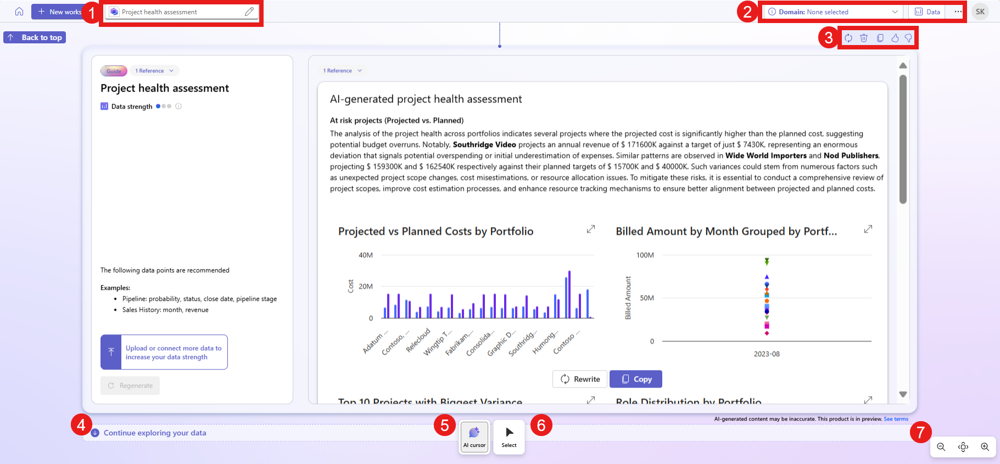

# Explore a topic (preview)

[This article is prerelease documentation and is subject to change.]

When you ask Project "Sophia" a question or add data and ask questions about the data, it generates a AI-powered blueprint. 

It's also beneficial to select **Domains** when you use Project “Sophia”. Choosing a domain provides a better understanding of the context of your question. For instance, in the context of sales and marketing, the terms "hunters" and "farmers" hold distinct meanings that might not be apparent without that context. Similarly, there are common acronyms that can mean something different based on context.

Follow these steps to ask a question:

1. Go to [https://projectsophia.microsoft.com](https://projectsophia.microsoft.com).
1. From the Home screen, select **New workspace**.
1. To get relevant results, select **Domains** located at the top right and choose a specific domain.
1. Enter your question in the text box and then select **Generate**.

You'll get an AI-powered blueprint in response to your question including an overview and suggested next steps.

## Ask questions about your data

One of the many benefits of Project Sophia is that you can connect to your business data; currently Dynamics 365 Sales. Additionally, you can further enrich the analysis by uploading data files. The [supported file formats](data-connections.md#supported-data-files) are .csv, .xlsx, and .pdf.

Use one of the following options to ask questions about your data:

   - On the Home screen, on the **Onboarding** tile, select **Go** > **Add data** > upload data or use the sample data. You can also use the sample sales data provided to familiarize yourself with Project "Sophia".
   - On the Home screen, select **New workspace** > **Add data** > use data from **Dataverse**, **Dynamics 365 Sales**, or other available connection types.
   - On the Home screen, select **New workspace** > **Add data** > **Upload files**.
    > [!IMPORTANT]
    > You need to have account at the data source to establish a connection to it. For more information, see [Connect to your data](data-connections.md).
    
Your data is analyzed to create a blueprint that provides valuable insights, charts, and actionable steps.

You can also start an analysis with **New workspace**. A new workspace is a blank canvas where you can explore and [ask questions](ask-question.md) related to your business. You can add business data and [ask questions about the data](ask-question.md#ask-questions-about-your-data). Access the workspace from the **Home** screen.

For more info about uploading files and supported data files, go to [Uploading files](data-connections.md#uploading-files)

For more info about data sources that you can connect to, go to [Connecting to a data source](data-connections.md#connecting-to-a-data-source)

### Work with content

 You can take the following actions when content is generated:

> [!div class="mx-imgBorder"]
> 

Legend:

1. **Workspace name**: To rename a workspace, select the default name **Untitled** and rename it.
1. Choose a domain, add [data](data-connections.md) and modify the [context](context-manage.md) Project "Sophia" uses to interpret information and produce blueprints.
1. Actions you can take on the entire blueprint:
    - **Regenerate** : Regenerate the results. Select **Regenerate with new data** to replace with another data set instead of starting over. The **Regenerate** option can generate different results, but the level of difference depends on the specificity of the question asked. For example, a general question such as "tell me something interesting about my data" generates different results.
    - **Delete** : Delete the blueprint.
    - **Copy** : Copy the blueprint.
    - Provide feedback: Select  or  to provide feedback on the blueprint.
1. **Continue exploring your data**: Create another blueprint to further explore your data. To learn more, go to [Journey lines](ai-cursor.md#journey-lines).
1. **AI cursor**: Use the [AI cursor](ai-cursor.md) to ask questions about the content on a blueprint or a block of content in the blueprint.
1. **Select tool**: Select a template or a block.
1. **Zoom and pan**: Use the zoom and pan options to quickly navigate content. The pan button provides an overview of the entire workspace, which lets you navigate and zoom in and out on a blueprint.
