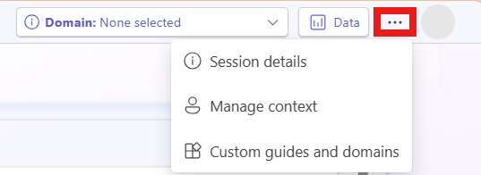

# Manage contexts

You can increase the relevancy and consistency of the content Project "Sophia" generates by adding _context_ to better interpret data. Project "Sophia" applies this context to your prompts automatically, so you don't have to repeat that same contextual information every time you interact with Project "Sophia".

For example, you can add the start of your organization's fiscal year to the context. Project "Sophia" can then relate input in prompts like _Q1_ or _this fiscal year_ to the correct period of time.

You can also add definitions for acronyms or column headings for your data used by your organization in the context. When they're used in prompts or present in your uploaded data or data sources, Project "Sophia" can correctly interpret their meaning and return better results.

To set and manage the context:

1. Select the options menu (**&hellip;**), then **Manage context.**

> [!div class="mx-imgBorder"]
> 

1. Enter context information. You don't need to fill in every field, but adding more context leads to more relevant content generated.

   - Turn on **Remember data for new workspaces** to have Project "Sophia" consider previously selected data and domains when working in new workspaces. Turn this off to only consider data and domains from the current workspace.
   - To delete the current context, data, and domain information, select **Delete all**.

1. Enter a question or topic to analyze with Project "Sophia".
