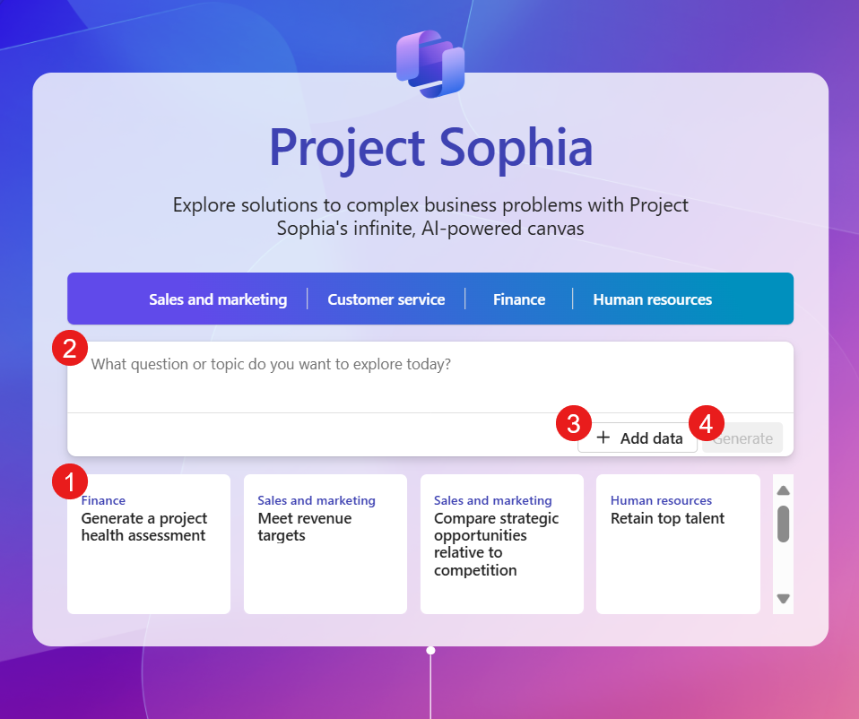
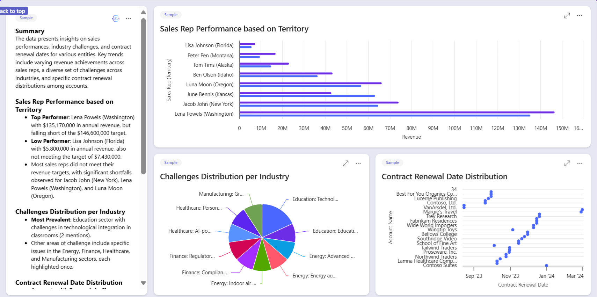
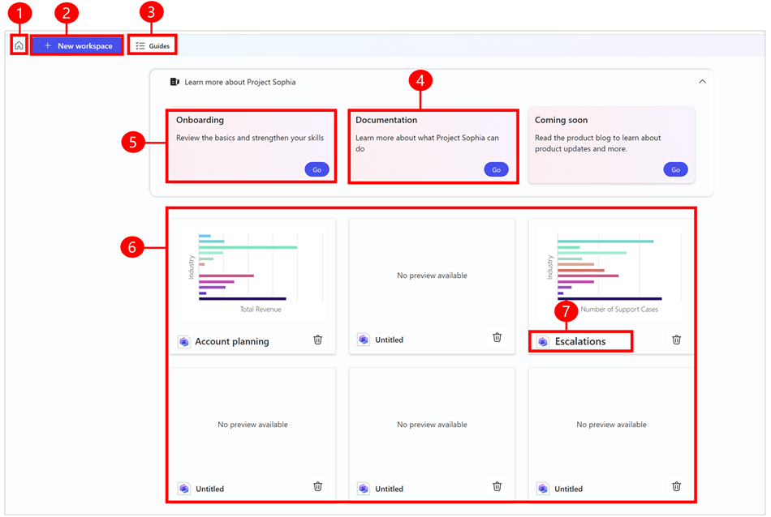

# Project “Sophia” overview (preview)

[This article is prerelease documentation and is subject to change.]

Project “Sophia” is a new generation of AI-first business app that helps users with complex, cross functional tasks, and offers a new way to discover, visualize, and interact with business data.

Project “Sophia” offers an AI- powered, user-friendly research canvas and large language model powered blueprints. The research canvas helps you create exploratory journeys and understand business data with AI-generated charts and insights without the need to manually mine data and create visuals. The app provides quick insights and recommends the next steps. You can start with a question and explore different options and can continue to iterate until you get the best possible outcome.

> [!IMPORTANT]
> - Project “Sophia” is available only in the European Union (EU) and United States region.
> - While Project "Sophia" is based on large language models that work with multiple languages, the product has been validated only in the English (United States) language. Other languages are currently not supported.
> - This is a preview feature. Preview features aren’t meant for production use and may have restricted functionality. These features are available before an official release so that customers can get early access and provide feedback.
> - By accessing or using the Project “Sophia”, you accept the [Microsoft Preview Terms of Service](https://go.microsoft.com/fwlink/?linkid=2242556).
> - Project “Sophia” uses Microsoft Bing and your research queries will be directed to Bing, which is governed by the Bing section of the [Microsoft Privacy Statement](https://privacy.microsoft.com/en-us/privacystatement).
> - This capability may be subject to usage limits or capacity throttling.

## Onboarding screen

The first time you sign in, you see the **Onboarding** screen where you can quickly generate blueprints using ready-made solutions. You can also go to the **Onboarding** screen from the **Home** screen: select **Go** on the **Onboarding** tile.

To generate blueprints from the **Onboarding** screen:

> [!div class="mx-imgBorder"]
> 

1. If you want, select the guide you want to follow for generating blueprints. Guides help you through the process of gathering relevant data to tackle specific role-based business tasks.
1. Enter the question or topic you want to explore. You can also provide Project "Sophia" with a [context](context-manage.md) in which to find and analyze data.
1. [Add the data](data-connections.md) you want to analyze. You can connect to data sources or upload your own files.
1. When you're ready, select **Generate** to create a blueprint.

## Blueprint

The blueprint shows results Project "Sophia" generates when you ask a question. You can also generate a new blueprint by selecting one of the suggested next steps. A blueprint consists of _blocks_ that summarize or visualize insights from your data.

> [!div class="mx-imgBorder"]
> 

## Home screen

The **Home** screen is your hub to access past workspaces, start new data explorations, and find help for using Project "Sophia".

> [!div class="mx-imgBorder"]
> 

Legend

1. **Home**: Takes you to the Home screen as shown in the screenshot.
2. **New workspace**: Opens a blank canvas where you can explore and ask questions related to your business. You can also upload data, or connect to data sources, and ask questions about the data. When you ask a question, a workspace is created that you can access from the Home screen.
3. **Guides**: Helps you through the process of gathering relevant data to tackle specific role-based business tasks. For preview, only the account planning guide is supported. Guides for sales territory planning, supply chain optimization, and others are coming soon.
4. **Documentation**: Access online help documentation.
5. **Onboarding**: Select **Go** to go to the [**Onboarding**](overview.md#onboarding-screen) screen.
6. **Workspace**: When you ask a question or add data and inquire about the data, a workspace is generated. You can access all your workspaces from the Home screen.
7. **Workspace name**: The name of your workspace. The default title of a workspace is **Untitled**. Select the title to rename it.

## Waiting room

If Project "Sophia" reaches its full capacity during the preview period, you're placed in a waiting room queue until there's more capacity. You can remain in the waiting room or sign up to be notified when Project "Sophia" is available to everyone without getting redirected to the waiting room.

> [!Note]
> If you choose to stay in the waiting room, don't refresh your browser as this will put you at the back of the queue.

## Authenticated and unauthenticated experience

If you don't sign in to Project "Sophia", you can't ask questions or add any data. However, you can still access a limited unauthenticated experience where you can use sample data and get a feel for Project "Sophia", and view suggested next steps.
