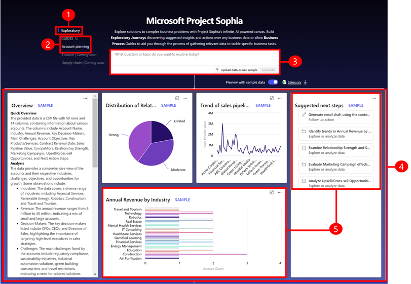

# Project “Sophia” overview (preview)

[This article is prerelease documentation and is subject to change.]

Project “Sophia” is a new generation of AI-first business app that helps users with complex, cross functional tasks and offers a new way to discover, visualize, and interact with business data. 

Project “Sophia” offers has an AI- powered, user-friendly research canvas and large language model powered blueprints. The research canvas helps users create exploratory journeys and understand business data with AI-generated charts and insights without the need for data mining and creating visuals. The app provides quick insights and recommends the next steps. You can start with a question and explore different options. Or you can continue iterating until you get the best possible outcome. 

> [!IMPORTANT]
> - Project “Sophia” is only available in the US region.
> - This is a preview feature. Preview features aren’t meant for production use and may have restricted functionality. These features are available before an official release so that customers can get early access and provide feedback.
> - By accessing or using the Project “Sophia”, you accept the [Microsoft Preview Terms of Service](https://go.microsoft.com/fwlink/?linkid=2242556).
> - Project “Sophia” uses Microsoft Bing and your research queries will be directed to Bing, which is governed by the Bing section of the [Microsoft Privacy Statement](https://privacy.microsoft.com/en-us/privacystatement).
> - This capability may be subject to usage limits or capacity throttling

You can interact with Project "Sophia" using the **Exploratory** and **Guides** option. The following screenshot provides more details about the interaction: 

> [!div class="mx-imgBorder"]
> 

Legend

1. **Exploratory**: Offers a blank canvas where you can explore and ask questions related to your business. Or you can upload business data and ask questions about the data. Project Sophia uses the uploaded data to generate insights and suggests next actions.
2. **Guides**: Helps you through the process of gathering relevant data to tackle specific role-based business tasks. For preview the account planning guide is supported. Guides for sales territory planning, supply chain optimization, and fiscal year close are coming soon.
3. **Question**: Enter your question.
4. **Blueprint**: The results that you see when you ask a question or upload data and then select **Generate**. You can also generate a new blueprint by selecting suggested next step.
5. **Block**: Example of the different blocks of content that is generate in a blueprint.   
