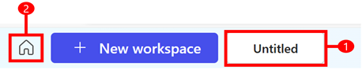
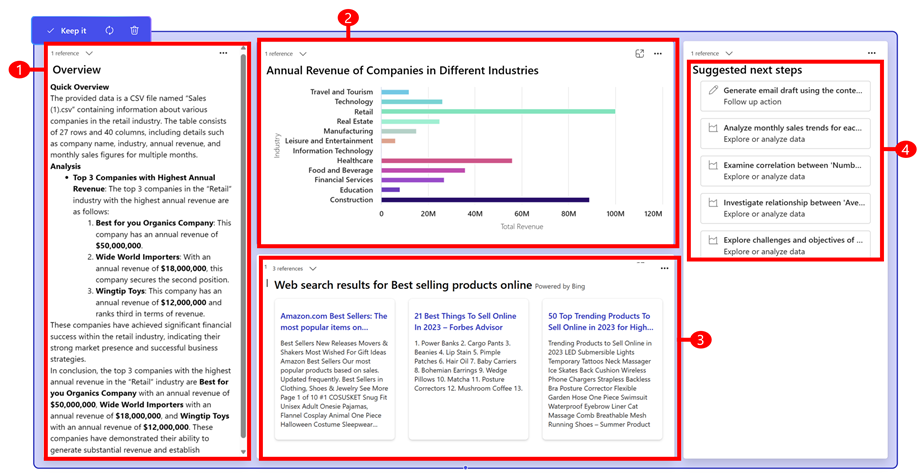

# What is a workspace? (preview)

[This article is prerelease documentation and is subject to change.]

When a new journey or guide is created, a workspace is automatically created and saved. 

> [!div class="mx-imgBorder"]
> 

Legend

1. **Home**: Go to Home to access all your workspaces.
2. **Workspace name**:  By default, a new workspace is saved as **Untitled**. We recommend that you rename your workspace so it’s easy to find. To rename a workspace, select the default name and rename it

A blueprint is created when you ask a question or upload data and select **Generate**. You can also generate a new blueprint by selecting an action in the  **Suggested next steps** block.

Use the [AI cursor](ai-cursor.md) to ask questions about the content on a blueprint, you can generate it as new blueprint or as a new block.

The following outlines the types of blocks that are generated in a blueprint:

> [!div class="mx-imgBorder"]
> 

Legend

1. **Text Overview**: Provides a summary and key insights at a glance.
2. **Chart**: Facilitates visual understanding of complex data or research findings. Chart blocks can render various chart types. It's primarily focuses on presenting top 10 items for quick overviews, but you can modify this range, filter data, or modify chart type using the AI Cursor. 
3. **News**: Delivers at least three current news articles or resources from global sources.  The relevance and quantity of the news articles are influenced by your specific selection within a block using the AI Cursor, or from a generic question, with or without file association. In cases of file association, world data is augmented to the local asset to ensure contextual relevance. Each article provides a link to the full resource, enabling users to explore the topic further. The news block, along with the context-awareness of the AI Cursor, provides a comprehensive response to questions asked.
4. **Suggested next steps**: Designed to inspire deeper explorations or actions based on the information currently available on the canvas. Every time you interact with the system either by asking questions or uploading files, the suggested next step block suggests up to five next actions that you can try to expand your analysis.You aren't limited to the suggested next steps generated by Project Sophia. You can always use the AI Cursor to write your own next step. 

